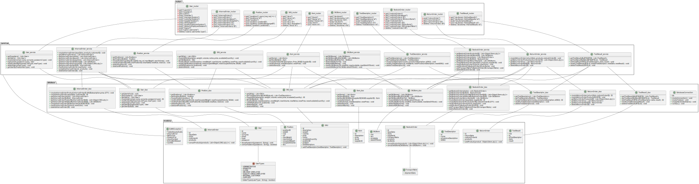

# Design Document

Authors: Abdelrahman SAYED AHMED , Giuseppe D'Andrea , Shayan Taghinezhad Roudbaraki , Giacomo Bruno

Date: 27/04/2022

Version: 2.0

# Contents

- [High level design](#package-diagram)
- [Low level design](#class-diagram)
- [Verification traceability matrix](#verification-traceability-matrix)
- [Verification sequence diagrams](#verification-sequence-diagrams)

# Instructions

The design must satisfy the Official Requirements document, notably functional and non functional requirements, and be consistent with the APIs

# High level design

```plantuml
package routers <<Folder>>{

}
package gui <<Folder>>{

}
package services <<Folder>>{

}
package database <<Folder>>{


}
package modules <<Folder>>{


}
package EzWhExceptions <<Folder>>{

}
gui --|> routers
routers --|> services
services --|> database
database --|> modules
services --|> EzWhExceptions : import
```

Architectural pattern: Layered

# Low level design



<!--
```plantuml
package modules {
    class EzWhException {
        + TableAlreadyExists
        + InternalError
        + NotFound
        + PositionFull
        + Unauthorized
        + EntryNotAllowed
        + Conflict
    }
	class SKU {
		+ id
		+ description
		+ weight
		+ volume
		+ price
		+ notes
		+ availableQuantity
		+ positionID
		+ position
		+ testDescriptors
		--
		+ addTestDescriptor(testDescriptor: TestDescriptor) : void
	}
	class SKUItem {
		+ rfid
		+ sku
		+ available
		+ dateOfStock
	}
	class Item {
		+ id
		+ description
		+ price
		+ skuId
		+ supplierId
	}
	class Position {
		+ positionID
		+ aisleID
		+ row
		+ col
		+ maxWeight
		+ maxVolume
		+ occupiedWeight
		+ occupiedVolume
		+ sku
	}
	enum UserTypes {
        + ADMINISTRATOR
        + MANAGER
        + CLERK
        + DELIVERY_EMPLOYEE
        + QUALITY_CHECK_EMPLOYEE
        + INTERNAL_CUSTOMER
        + SUPPLIER
        --
        + isUserTypes(userType : String) : boolean
	}
	class User {
		+ id
		+ name
		+ surname
		+ email
		+ type
		+ password
		__
		+ storePassword(password : String) : void
		+ verifyPassword(password : String) : boolean
	}
	class RestockOrder {
		+ id
		+ issueDate
		+ state
		+ supplierId
		+ transportNote
		+ products
		+ skuItems
		__
		+ concatProducts(products : List<Object{Item, qty}>) : void
		+ concatSKUItems(SKUItems: List<SKUItem>) : void
	}
	class ReturnOrder {
		+ id
		+ returnDate
		+ restockOrderId
		+ products
		--
		+ addProduct(product : Object{Item, qty}) : void
	}

	class InternalOrder {
		+ id
		+ issueDate
		+ state
		+ customerId
		+ products
		__
		+ concatProducts(products : List<Object{SKU, qty}>) : void
	}
	class TestDescriptor {
		+ id
		+ name
		+ procedureDescription
		+ idSKU
	}
	class TestResult {
		+ rfid
		+ id
		+ idTestDescriptor
		+ date
		+ result
	}
	class TransportNote {
	    + shipmentDate
	}
}

package database {
    class DatabaseConnection {
        + db
        --
        + createConnection() : void
        + createTables() : void
        + createHardcodedUsers() : void
        + runSQL() : void
    }
    
    class InternalOrder_dao {
        + createInternalOrderProduct(internalOrderID, SKUID,description,price, QTY) : void
        + createInternalOrder(issueDate, customerID) : ID
        + getInternalOrders(state) : List<InternalOrder>
        + getInternalOrderByID(id) : InternalOrder
        + getInternalOrderProductByInternalOrderID(ID) : List<Object{SKU, qty}>
        + getInternalOrderSKUItemByInternalOrderID(ID) : List<SKUItem>
        + createInternalOrderSKUItem(orderId,SKUID, RFID) : void
        + modifyInternalOrderState(id, newState) : void
        + deleteInternalOrder(ID) : void
    }
    class Item_dao {
        + getItems() : List<Item>
        + getItemByID(id) : Item
        + getItemBySKUIDAndSupplierID(SKUID, supplierID) : Item
        + createItem(item) : ID
        + modifyItem(id, newDescription, newPrice) : void
        + deleteItem(id) : void
        + deleteAllItems() : void
    }
    class Position_dao {
        + getPositions() : List<Position>
        + getPositionByID(id) : Position
        + createPosition(position) : ID
        + modifySKUPosition(positionId, newOccupiedWeight, newOccupiedVolume, SKUId) : void
        + modifyPositionID(oldID, newPositionID, newAisleID, newRow, newCol) : void
        + deletePosition(id) : void
        + deleteAllPositions() : void
    }
    class RestockOrder_dao {
        + getRestockOrders(state) : List<RestockOrder>
        + getRestockOrderByID(id) : RestockOrder
        + getRestockOrderProductsByRestockOrderID(ID) : List<Object{Item, qty}>
        + getRestockOrderSKUItemsByRestockOrderID(ID) : List<SKUItem>
        + getRestockOrderReturnItems(ID) : List<SKUItem>
        + createRestockOrder(issueDate, supplierID) : ID
        + createRestockOrderProduct(itemID, restockOrderID, QTY) : void
        + modifyRestockOrderState(id, newState) : void
        + addSkuItemToRestockOrder(ID, RFID) : void
        + addTransportNoteToRestockOrder(ID, transportNote) : void
        + deleteRestockOrder(ID) : void
    }
    class ReturnOrder_dao {
        + createReturnOrder(returnDate, restockOrderID) : ID
        + createReturnOrderProducts(ID, RFID) : void
        + getReturnOrderProducts(ID) : List<Object{Item, qty}>
        + getReturnOrders() : List<ReturnOrder>
        + getReturnOrderByID(ID) : ReturnOrder
        + deleteReturnOrder(ID) : void
    }
    class SKU_dao {
        + getSKUs() : List<SKU>
        + getTestDescriptorsBySKUID(skuid) : List<TestDescriptor>
        + createSKU(description, weight, volume, notes, price, availableQuantity) : ID
        + getSKUById(id) : SKU
        + modifySKU(id, newDescription, newWeight, newVolume, newNotes, newPrice, newAvailableQuantity) : void
        + addSKUPosition(id, positionId) : void
        + deleteSKU(id) : void
        + deleteAllSKUs() : void
    }
    class SKUItem_dao {
        + getSKUItems() : List<SKUItem>
        + getSKUItemsBySKU(SKUID) : List<SKUItem>
        + getSKUItemByRfid(rfid) : SKUItem
        + createSKUItem(rfid, SKUId, dateOfStock) : ID
        + modifySKUItem(rfid, newRfid, newAvailable, newDateOfStock) : void
        + deleteSKUItem(rfid) : void
        + deleteAllSKUItems() : void
    }
    class TestDescriptor_dao {
        + getTestDescriptors() : List<TestDescriptor>
        + getTestDescriptorByID(id) : TestDescriptor
        + createTestDescriptor(name, procedureDescription, idSKU) : ID
        + modifyTestDescriptor(testDescriptor) : void
        + deleteTestDescriptor(id) : void
    }
    class TestResult_dao {
        + getTestResultsByRFID(RFID) : List<TestResult>
        + getTestResultByIDAndRFID(RFID, id) : TestResult
        + addTestResult(RFID, idTestDescriptor, date, result) : ID
        + modifyTestResult(testResult) : void
        + deleteTestResult(RFID, id) : void
    }
    class User_dao {
        + getUserInfo(id) : void
        + getSuppliers() : List<User>
        + getUsers() : List<User>
        + createUser(email, name, surname, password, type) : ID
        + modifyUserRights(email, oldType, newType) : void
        + deleteUser(email, type) : void
        + getUserByEmail(email, type) : User
        + getUserByID(ID) : User
    }
}

package routers {
    class InternalOrder_router {
        - post("/internalOrders"),
        - get("/internalOrders"),
        - get("/internalOrdersIssued"),
        - get("/internalOrdersAccepted"),
        - get("/internalOrders/:id")
        - put("/internalOrders/:id"),
        - delete("/internalOrders/:ID")
    }
    class Item_router {
        - get("/items")
        - get("/items/:id")
        - delete("/items/:id")
        - post("/item")
        - put("/item/:id")
    }
    class Position_router {
        - get("/positions"), async (req, res) => {
        - get("/positions/:id")
        - post("/position")
        - put("/position/:positionID")
        - put("/position/:positionID/changeID")
        - delete("/position/:positionID")
    }
    class RestockOrder_router {
        - get("/restockOrders")
        - get("/restockOrdersIssued")
        - get("/restockOrders/:ID")
        - get("/restockOrders/:ID/returnItems")
        - post("/restockOrder")
        - put("/restockOrder/:ID")
        - put("/restockOrder/:ID/skuItems")
        - put("/restockOrder/:ID/transportNote")
        - delete("/restockOrder/:ID")
    }
    class ReturnOrder_router {
        - post("/returnOrder")
        - get("/returnOrders")
        - get("/returnOrders/:ID")
        - delete("/returnOrder/:ID")
    }
    class SKUItem_router {
        - get("/skuitems")
        - get("/skuitems/sku/:id")
        - get("/skuitems/:rfid")
        - post("/skuitem")
        - put("/skuitems/:rfid")
        - delete("/skuitems/:rfid")
    }
    class SKU_router {
        - get("/skus")
        - get("/skus/:id")
        - post("/sku")
        - put("/sku/:id")
        - put("/sku/:id/position")
        - delete("/skus/:id")
    }
    class TestDescriptor_router {
        - get("/testDescriptors")
        - get("/testDescriptors/:id")
        - post("/testDescriptor")
        - put("/testDescriptor/:id")
        - delete("/testDescriptor/:id")
    }
    class TestResult_router {
        - get("/skuitems/:rfid/testResults")
        - get("/skuitems/:rfid/testResults/:id")
        - post("/skuitems/testResult")
        - put("/skuitems/:rfid/testResult/:id")
        - delete("/skuitems/:rfid/testResult/:id")
    }
    class User_router {
        - get("/userinfo")
        - get("/suppliers")
        - get("/users")
        - post("/newUser")
        - post("/managerSessions")
        - post("/customerSessions")
        - post("/supplierSessions")
        - post("/clerkSessions")
        - post("/qualityEmployeeSessions")
        - post("/deliveryEmployeeSessions")
        - post("/logout")
        - put("/users/:username")
        - delete("/users/:username/:type")
    }
}

package services {
    class InternalOrder_service {
        + createInternalOrder(issueDate, products, customerID) : void
        + getAllInternalOrders() : List<InternalOrder>
        + getInternalOrders(state) : List<InternalOrder>
        + getInternalOrdersIssued() : List<InternalOrder>
        + getInternalOrdersAccepted() : List<InternalOrder>
        + getInternalOrderSKUItems(ID) : List<SKUItem>
        + getInternalOrderProducts(ID) : List<Object{SKU, qty}>
        + getInternalOrderByID(ID) : InternalOrder
        + modifyInternalOrder(id, newState) : void
        + completeInternalOrder(id , products) : void
        + deleteInternalOrder(ID) : void
    }
    class Item_service {
        + getItems() : List<Item>
        + getItemByID(id) : Item
        + createItem(ItemID, Description, Price, SKUID, SupplierID) : void
        + modifyItem(id, newDescription, newPrice) : void
        + deleteItem(id) : void
    }
    class Position_service {
        + getPositions() : List<Position>
        + getPositionByID(id) : Position
        + createPosition(positionID, aisleID, row, col, maxWeight, maxVolume) : void
        + modifyPositionID(oldID, newPositionID, newAisleID, newRow, newCol) : void
        + deletePosition(id) : void
        + deleteAllPositions() : void
    }
    class RestockOrder_service {
        + getRestockOrderProducts(ID) : List<Object{Item, qty}>
        + getRestockOrderSKUItems(ID) : List<SKUItem>
        + getRestockOrders(state) : List<RestockOrder>
        + getRestockOrderByID(id) : RestockOrder
        + getRestockOrderReturnItems(id) : List<SKUItem>
        + createRestockOrder(issueDate, products, supplierID) : void
        + modifyRestockOrderState(id, newState) : void
        + addSkuItemsToRestockOrder(ID, skuItems) : void
        + addTransportNoteToRestockOrder(ID, transportNote) : void
        + deleteRestockOrder(ID) : void
    }
    class ReturnOrder_service {
        + createReturnOrder(returnDate, products, restockOrderID) : void
        + getReturnOrderProducts(returnOrderID) : List<Object{Item, qty}>
        + getReturnOrders() : List<ReturnOrder>
        + getReturnOrderByID(ID) : ReturnOrder
        + deleteReturnOrder(ID) : void
    }
    class SKUItem_service {
        + getSKUItems() : List<SKUItem>
        + getSKUItemsBySKU(SKUID) : List<SKUItem>
        + getSKUItemByRfid(rfid) : SKUItem
        + deleteSKUItem(rfid) : void
        + deleteAllSKUItems() : void
        + modifySKUItem(rfid, newRfid, newAvailable, newDateOfStock) : void
        + createSKUItem(rfid, SKUId, dateOfStock) : void
    }
    class SKU_service {
        + getSKUs() : List<SKU>
        + createSKU(description, weight, volume, notes, price, availableQuantity) : void
        + getSKUById(id) : SKU
        + modifySKU(id, newDescription, newWeight, newVolume, newNotes, newPrice, newAvailableQuantity) : void
        + modifySKUPosition(positionId, newOccupiedWeight, newOccupiedVolume, SKUId) : void
        + addSKUPosition(id, positionId) : void
        + deleteSKU(id) : void
    }
    class TestDescriptor_service {
        + getTestDescriptors() : List<TestDescriptor>
        + getTestDescriptorByID(id) : TestDescriptor
        + createTestDescriptor(name, procedureDescription, idSKU) : void
        + modifyTestDescriptor(id, newName, newProcedureDescription, newIdSKU) : void
        + deleteTestDescriptor(id) : void
    }
    class TestResult_service {
        + getTestResultsByRFID(RFID) : List<TestResult>
        + getTestResultByIDAndRFID(RFID, id) : TestResult
        + addTestResult(RFID, idTestDescriptor, date, result) : void
        + modifyTestResult(RFID, id, newIdTestDescriptor, newDate, newResult) : void
        + deleteTestResult(RFID, id) : void
    }
    class User_service {
        + getSuppliers() : List<User>
        + getUsers() : List<User>
        + createUser(email, name, surname, password, type) : void
        + login(email, password, type) : User
        + modifyUserRights(email, oldType, newType) : void
        + deleteUser(email, type) : void
        + getUserByEmail(email, type) : void
    }
}

services --- EzWhException
RestockOrder --- TransportNote
User --- UserTypes

InternalOrder_dao --- InternalOrder
Item_dao --- Item
Position_dao --- Position
RestockOrder_dao --- RestockOrder
ReturnOrder_dao --- ReturnOrder
SKU_dao --- SKU
SKUItem_dao --- SKUItem
TestDescriptor_dao --- TestDescriptor
TestResult_dao --- TestResult
User_dao --- User

InternalOrder_router --- InternalOrder_service
Item_router --- Item_service
Position_router --- Position_service
RestockOrder_router --- RestockOrder_service
ReturnOrder_router --- ReturnOrder_service
SKU_router --- SKU_service
SKUItem_router --- SKUItem_service
TestDescriptor_router --- TestDescriptor_service
TestResult_router --- TestResult_service
User_router --- User_service

InternalOrder_service --- InternalOrder_dao
InternalOrder_service --- SKU_dao
InternalOrder_service --- SKUItem_dao
InternalOrder_service --- User_dao
Item_service --- Item_dao
Item_service --- SKU_dao
Item_service --- User_dao
Position_service --- Position_dao
RestockOrder_service --- RestockOrder_dao
RestockOrder_service --- Item_dao
RestockOrder_service --- SKUItem_dao
ReturnOrder_service --- ReturnOrder_dao
ReturnOrder_service --- RestockOrder_dao
ReturnOrder_service --- SKU_dao
ReturnOrder_service --- SKUItem_dao
SKU_service --- SKU_dao
SKU_service --- Position_dao
SKUItem_service --- SKUItem_dao
SKUItem_service --- SKU_dao
TestDescriptor_service --- TestDescriptor_dao
TestDescriptor_service --- SKU_dao
TestResult_service --- TestResult_dao
TestResult_service --- TestDescriptor_dao
TestResult_service --- SKUItem_dao
User_service --- User_dao
```
-->

This design is based on the Facade pattern, in this way the API can communicate only with the Facade class that works as an interface between all the other classes.
DbHelper is the interface for the database and is used to obtain persistance.

# Verification traceability matrix

| FR    | EzWh | DbHelper | User | SKU | SKUItem | TestDescriptor | TestResult | Position | Item | RestockOrder | InternalOrder | ReturnOrder | TransportNote |
| ---   | :--: | :------: | :--: | :-: | :-----: | :------------: | :--------: | :------: | :--: | :----------: | :-----------: | :---------: | :-----------: |
| FR1   |  x   |    x     |  x   |     |         |                |            |          |      |              |               |             |			      |
| FR2   |  x   |    x     |      |  x  |         |       x        |            |     x    |      |              |               |             |			      |
| FR3.1 |  x   |    x     |      |  x  |         |                |            |     x    |      |              |               |             |			      |
| FR3.2 |  x   |    x     |      |     |         |       x        |     x      |          |      |              |               |             |			      |
| FR4   |  x   |    x     |  x   |     |         |                |            |          |      |              |               |             |		 	      |
| FR5   |  x   |    x     |      |  x  |    x    |                |            |          |  x   |      x       |               |      x      |       x       |
| FR6   |  x   |    x     |      |  x  |    x    |                |            |          |      |              |       x       |             |			      |
| FR7   |  x   |    x     |  x   |  x  |         |                |            |          |  x   |              |               |             |			      |

# Verification sequence diagrams

## Scenario 1-1 - Create SKU

```plantuml
actor Manager
participant EzWh
note over EzWh: Includes Frontend and API
participant Service
participant Database
note over Database: id is generated\nby database
participant SKU

Manager -> EzWh: Selects description D, weight W, volume V,\nnotes N, price P, availableQuantity Q
EzWh -> Service: createSKU(D, W, V, N, P, Q)
activate Service
Service -> Database: createSKU(D, W, V, N, P, Q)
activate Database
Database -> Database : id is generated
Database -> SKU: new SKU(id, D, W, V, N, P, Q)
activate SKU
SKU -> Database: SKU
deactivate SKU
Database -> Service : SKU
deactivate Database
Service --> EzWh : Done
deactivate Service
EzWh --> Manager : Done
```

## Scenario 1-3 - Modify SKU weight and volume

```plantuml
actor Manager
participant EzWh
note over EzWh: Includes Frontend and API
participant Service
participant Database
participant SKU

Manager -> EzWh: Selects SKU S, description D, newWeight W, newVolume V,\nnotes N, price, P, availableQuantity Q
EzWh -> Service: modifySKU(S, D, W, V, N, P, Q)
Service -> Database : sku = getSKUById(S)
activate Database
Database -> Service : SKU
deactivate Database
Service -> SKU: sku.setDescription(D)
activate SKU
SKU --> Service: Done
deactivate SKU
Service -> SKU: sku.setWeight(W)
activate SKU
SKU --> Service: Done
deactivate SKU
Service -> SKU: sku.setVolume(V)
activate SKU
SKU --> Service: Done
deactivate SKU
Service -> SKU: sku.setNotes(N)
activate SKU
SKU --> Service: Done
deactivate SKU
Service -> SKU: sku.setPrice(P)
activate SKU
SKU --> Service: Done
deactivate SKU
Service -> SKU: sku.setAvailableQuantity(Q)
Service -> Database : modifySKU(sku)
activate Database
Database --> Service : Done
deactivate Database
Service --> EzWh : Done
EzWh --> Manager : Done
```

## Scenario 2-1 - Create position

```plantuml
actor Manager
participant EzWh
note over EzWh: Includes Frontend and API
participant Service
participant Database
participant Position

Manager -> EzWh: Selects positionId P, aisleId A, row R,\ncol C, maxWeight W, maxVolume V
EzWh -> Service: createPosition(P, A, R, C, W, V)
activate Service
Service -> Database: createPosition(P, A, R, C, W, V)
activate Database
Database-> Position: new Position(P, A, R, C, W, V)
activate Position
Position -> Database: Position
deactivate Position
Database->Service: Position
deactivate Database
Service --> EzWh: Done
deactivate Service
EzWh --> Manager : Done
```

## Scenario 2-2 - Modify positionID of P

```plantuml
actor Manager
participant EzWh
note over EzWh: Includes Frontend and API
participant Service
participant Database

Manager -> EzWh: Selects positionId P and newPositionId N
EzWh -> Service: modifyPositionId(P, N)
activate Service
Service -> Database : modifyPositionId(P, N)
activate Database
Database --> Service : Done
deactivate Database
Service --> EzWh : Done
deactivate Service
EzWh --> Manager : Done
```

## Scenario 3-1 - Restock Order of SKU S issued by quantity

```plantuml
actor Manager
participant EzWh
note over EzWh: Includes Frontend and API
participant Service
participant Database
note over Database: id is generated\nby database
participant RestockOrder

Manager -> EzWh: Creates Restock Order, inserts issueDate D,\nItem I, quantity Q and Supplier SP
EzWh -> Service: CreateRestockOrder(D, Map<I, Q>, SP)
activate Service
Service -> Database: restockOrder = CreateRestockOrder (D, Map<I, Q>, SP)
activate Database
Database -> RestockOrder: new RestockOrder(id, D, Map<I, Q>, SP)
activate RestockOrder
RestockOrder --> Database: RestockOrder
Deactivate RestockOrder
Database --> Service: RestockOrder
deactivate Database
Service --> EzWh: Done
deactivate Service
EzWh --> Manager: Done
```

## Scenario 4-1 - Create user and define rights

```plantuml
actor Administrator
participant EzWh
note over EzWh: Includes Frontend and API
participant Service
participant Database
note over Database: id is generated\nby database
participant User

Administrator -> EzWh: Selects email EM, name N, surname S, password P, type T
EzWh -> Service: User_service.createUser(EM, N, S, P, T)
activate Service
Service -> Database: User_dao.createUser(EM, N, S, P, T)
activate Database
Database -> Database: id is generated
Database -> User: new User(id, N, S, EM, T, P)
activate User
User -> Database: User
deactivate User
Database -> Service: User
deactivate Database
Service --> EzWh: Done
deactivate Service
EzWh --> Administrator: Done
```

## Scenario 6-1 - Return order of SKU items that failed quality test

```plantuml
actor Manager
participant EzWh
participant Service
participant Database
note over Database: id is generated\nby database
participant RestockOrder
participant SkuItem
participant ReturnOrder


Manager -> EzWh: System provide RFID of SKU items\nthat not passed quality tests
EzWh -> Service: getRestockOrderById()
activate Service
Service -> Database: restockOrder = getRestockOrderById(id)
activate Database
Database -> RestockOrder: new RestockOrder(id, issueDate, state,\nproducts, supplierId, transportNote, skuItems)
activate RestockOrder
RestockOrder --> Database: RestockOrder
Deactivate RestockOrder
Database --> Service: RestockOrder
deactivate Database
Service -> SkuItem: skuItems = restockOrder.getSkuItems()
activate SkuItem
SkuItem --> Service: List<SkuItem>
deactivate SkuItem
Service --> EzWh: List<SkuItem>
deactivate Service
EzWh --> Manager: List<SkuItem>

Manager -> EzWh: Create Return Order and\ninsert SKU Items to be returned
EzWh -> Service: createReturnOrder(date, products, restockorderid)
activate Service
Service -> Database: returnOrder = createReturnOrder(date, products, restockorderid)
activate Database
Database -> ReturnOrder: new ReturnOrder(id, date, products, restockOrderId)
activate ReturnOrder
ReturnOrder --> Database: ReturnOrder
Deactivate ReturnOrder
Database --> Service: ReturnOrder
deactivate Database
Service -> SkuItem: Foreach skuItem in products\n  skuItem.setAvailable(False)
activate SkuItem
SkuItem --> Service: Done
Deactivate SkuItem
Service -> Database: Foreach skuItem in products\n  modifySkuItem(skuItem)
activate Database
Database --> Service: Done
Deactivate Database
deactivate Service
Service --> EzWh: Done
EzWh --> Manager: Done
```

## Scenario 9-1 - Internal Order IO accepted

```plantuml
actor Customer
actor Manager
participant EzWh
note over EzWh: Includes Frontend and API
note over Database: id is generated\nby database
participant Service
participant Database
participant InternalOrder


Customer -> EzWh: adds every SKU she wants in every qty to IO
activate EzWh
EzWh ->EzWh : C.ID = getUserInfo()
EzWh -> Service: createInternalOrder(date, <SKU,qty>, C.id)
activate Service
Service ->Database :createInternalOrder(date, <SKU,qty>, C.id)
activate Database
Database -> Database : id is generated
Database ->InternalOrder: new internalOrder(id,issueDate, ISSUED,  <SKU,qty>, C.id)
activate InternalOrder
InternalOrder-->Database : InternalOrder
deactivate InternalOrder
Database --> Service : InternalOrder
Service->Database : modifySKU(newAvailableQuantity)
Service->Database :modifyPosition(newOccupiedWeight , newOccupiedVolume)
Database --> Service : InternalOrder
deactivate Database
Service -->EzWh :InternalOrder
deactivate Service
Service -->Manager :InternalOrder
EzWh --> Customer : Done
deactivate EzWh

Manager -> EzWh: Selects new InternalOrder
activate EzWh
EzWh -> Service : modifyInternalOrderState(Accepted)
activate Service
Service->Database : modifyInternalOrderState(Accepted)
activate Database
Database --> Service : done
deactivate Database
Service --> EzWh : done
deactivate Service
EzWh --> Manager : done
deactivate EzWh


```

## Scenario 11-1 - Create Item I

```plantuml
actor Supplier
participant EzWh
note over EzWh: Includes Frontend and API
note over Database: id is generated\nby database
participant Service
participant Database
participant Item

Supplier -> EzWh: Selects description D, Price P , SKU

EzWh ->EzWh : S.ID = getUserInfo()

EzWh -> Service:createItem(D , SKU, P, S.ID)

activate Service
Service -> Database: item = createItem(D , P, SKU, S.ID)
activate Database
Database -> Database : id is generated
Database -> Item : new Item(ID, D , P , SKU , S.ID)

activate Item
Item --> Database: Item
deactivate Item
Database --> Service : Item
deactivate Database
Service --> EzWh : Done
deactivate Service
EzWh-->Supplier : Done
```

## Scenario 11-2 - Modify Item description and price

```plantuml
actor Supplier
participant EzWh
note over EzWh: Includes Frontend and API
participant Service
participant Database


Supplier -> EzWh: Search Item I
activate EzWh
EzWh -> Service: getItembyId(id)
activate Service
Service -> Database : getItembyId(id)
activate Database
Database --> Service : Item
deactivate Database
Service --> EzWh : Item
deactivate Service
EzWh --> Supplier : Item
deactivate EzWh

Supplier -> EzWh :Selects fot ID newDescription nD, newPrice P
activate EzWh
EzWh ->Service : modifyItem(ID,nD,nP)
activate Service
Service ->Database : modifyItem(ID,nD,nP)
activate Database
Database --> Service : Done
deactivate Database
Service --> EzWh : Done
deactivate Service
EzWh --> Supplier : Done
deactivate EzWh
```

## Scenario 12-1 - Create test descriptor

```plantuml
actor Manager
participant EzWh
note over EzWh: Includes Frontend and API
participant Service
participant Database
note over Database: id is generated\nby database
participant TestDescriptor
participant SKU

Manager -> EzWh: Selects name N, procedureDescription PD, idSKU IS
EzWh -> Service: TestDescriptor_service.createTestDescriptor(N, PD, IS)
activate Service
Service -> Database: TestDescriptor_dao.createTestDescriptor(N, PD, IS)
activate Database
Database -> Database : id is generated
Database -> TestDescriptor: new TestDescriptor(id, N, PD, IS)
activate TestDescriptor
TestDescriptor -> Database: TestDescriptor td
deactivate TestDescriptor
Database -> Service: td
deactivate Database
deactivate Database
Service --> EzWh: Done
deactivate Service
EzWh --> Manager: Done
```
