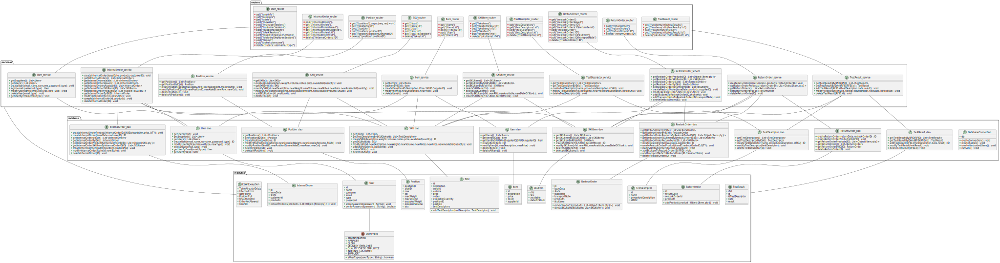

# Design Document

Authors: Abdelrahman SAYED AHMED , Giuseppe D'Andrea , Shayan Taghinezhad Roudbaraki , Giacomo Bruno

Date: 27/04/2022

Version: 2.0

# Contents

- [High level design](#package-diagram)
- [Low level design](#class-diagram)
- [Verification traceability matrix](#verification-traceability-matrix)
- [Verification sequence diagrams](#verification-sequence-diagrams)

# Instructions

The design must satisfy the Official Requirements document, notably functional and non functional requirements, and be consistent with the APIs

# High level design

```plantuml
package it.polito.ezwh.controller <<Folder>>{

}
package it.polito.ezwh.gui <<Folder>>{

}
package it.polito.ezwh.data <<Folder>>{


}
package it.polito.ezwh.exceptions <<Folder>>{

}
it.polito.ezwh.gui --|> it.polito.ezwh.controller
it.polito.ezwh.controller --|> it.polito.ezwh.data
it.polito.ezwh.data --|> it.polito.ezwh.exceptions : import
```

Architectural pattern: Layered

# Low level design



<!--
```plantuml
class EzWhFacade {
	+ db : DbHelper
	__
	+ getSKUs() : List<SKU>
	+ getSKUById(id : Integer) : SKU
	+ getSKUByDescription(description : String) : List<SKU>
	+ createSKU(description : String, weight : Double, volume : Double, notes : String, price : Double, availableQuantity : Integer) : void
	+ modifySKU(id : String, newDescription : String, newWeight : Double, newVolume : Double, newNotes : String, newPrice : Double, newAvailableQuantity : Integer) : void
	+ addSKUPosition(id : String, position : Position) : void
	+ deleteSKU(id : String) : void
	..
	+ getSKUItems() : List<SKUItem>
	+ getSKUItemsBySKU(SKUid : Integer) : List<SKUItem>
	+ getSKUItemByRfid(rfid : String) : SKUItem
	+ createSKUItem(rfid : String, SKUid : Integer, dateOfStock : String) : void
	+ modifySKUItem(rfid : String, newRfid : String, newAvailable : Bool, newDateOfStock : String) : void
	+ deleteSKUItem(rfid : String) : void
	..
	+ getPositions() : List<Position>
	+ createPosition(positionId : String, aisleId : String, row : String, col : String, maxWeight : Double, maxVolume : Double) : void
	+ modifyPosition(positionId : String, newAisleId : String, newRow : String, newCol : String, newMaxWeight : Double, newMaxVolume : Double, newOccupiedWeight : Double, newOccupiedVolume : Double) : void
	+ modifyPositionId(positionId : String, newPositionId: String) : void
	+ deletePositionId(positionId : String) : void
	~ getPositionById(positionId : String) : Position
	..
	+ getTestDescriptors(): List<TestDescriptor>
	+ getTestDescriptorByID(id: Integer): TestDescriptor
	+ createTestDescriptor(name: String, procedureDescription: String, idSKU: Integer): void
	+ modifyTestDescriptor(id: Integer, newName: String, newProcedureDescription: String, newIdSKU: Integer): void
	+ deleteTestDescriptor(id: Integer): void
	..
	+ getTestResultsByRFID(RFID: String): List<TestResult>
	+ getTestResultByIDAndRFID(RFID: String, id: Integer): TestResult
	+ addTestResult(RFID: String, idTestDescriptor: Integer, date: String, result: boolean): void
	+ modifyTestResult(RFID: String, id: Integer, newIdTestDescriptor: Integer, newDate: String, newResult: boolean): void
	+ deleteTestResult(RFID: String, id: Integer): void
	..
	+ getUserInfo(id: Integer): User
	+ getSuppliers(): List<User>
	+ getUsers(): List<User>
	+ createUser(email: String, name: String, surname: String, password: String, type: String): void
	+ login(email: String, password: String, type: String): User
	+ logout(id : Integer): void
	+ modifyUserRights(email: String, oldType: String, newType: String): void
	+ deleteUser(email: String, type: String): void
	~ getUserByEmail(email: String): User
	..
	+ getItems (): List<Item>
	+ getItemById (id: String) : Item
	+ createItem( description: String, price : double, SKUId : String, supplierId : String): void
	+ modifyItem(id: String, newDescription: String, newPrice: double ): void
	+ deleteItem(id:String) : void
	..
	+ getRestockOrders() : List<RestockOrder>
	+ getRestockOrdersIssued() : List<RestockOrder>
	+ getRestockOrderById(id : Integer) : RestockOrder
	+ getRestockOrderReturnItems(id : Integer) : List<SKUItem>
	+ createRestockOrder(issueDate : String, products : Map<Item, Integer>, supplierId : Integer) : void
	+ modifyRestockOrder(id : Integer, state : String)
	+ addSkuItemsToRestockOrder(id : Integer, skuItems : List<SKUItem>) : void
	+ addTransportNoteToRestockOrder(id : Integer, transportNote : TransportNote) : void
	+ deleteRestockOrder(id : Integer) : void
	..
	+ getReturnOrders() : List<ReturnOrder>
	+ getReturnOrderById(id : Integer) : ReturnOrder
	+ createReturnOrder(returnDate : String, products : List<SkuItem>, restockOrderId : Integer) : void
	+ deleteReturnOrder(id : Integer) : void
	..
	+ getInternalOrders() : List<InternalOrder>
	+ getInternalOrdersIssued() : List<InternalOrder>
	+ getInternalOrdersAccepted() : List<InternalOrder>
	+ getInternalOrderById(id : Integer) : InternalOrder
	+ createInternalOrder(issueDate : String, products : Map<SKU, Integer>, customerId : Integer) : void
	+ modifyInternalOrderState(id : Integer, state : String, RFIDs : List<SKUItem>) : void
	+ deleteInternalOrder(id : Integer) : void
}

class DbHelper {
	+ dbName : String
	+ dbConnection : Connection
	__
	+ DbHelper(dbName : String) : DbHelper
	..
	+ createConnection() : void
 	+ closeConnection() : void
 	+ createTables(): void
 	+ dropTables(): void
 	..
	+ getSKUs() : List<SKU>
	+ getSKUById(id : Integer) : SKU
	+ getSKUByDescription(description : String) : List<SKU>
	+ createSKU(description : String, weight : Double, volume : Double, notes : String, price : Double, availableQuantity : Integer) : SKU
	+ modifySKU(sku : SKU) : void
	+ addSKUPosition(id : String, position : Position) : void
	+ deleteSKU(id : String) : void
	..
	+ getSKUItems() : List<SKUItem>
	+ getSKUItemsBySKU(SKUid : Integer) : List<SKUItem>
	+ getSKUItemByRfid(rfid : String) : SKUItem
	+ createSKUItem(skuItem : SKUItem) : void
	+ modifySKUItem(skuItem : SKUItem) : void
	+ deleteSKUItem(rfid : String) : void
	..
	+ getPositions() : List<Position>
	+ createPosition(position : Position) : void
	+ modifyPosition(position : Position) : void
	+ modifyPositionId(positionId : String, newPositionId: String) : void
	+ deletePositionId(positionId : String) : void
	+ getPositionById(positionId : String) : Position
	..
	+ getTestDescriptors(): List<TestDescriptor>
	+ createTestDescriptor(name: String, procedureDescription: String, idSKU: Integer): TestDescriptor
	+ modifyTestDescriptor(testDescriptor : TestDescriptor): void
	+ deleteTestDescriptor(id: Integer): void
	..
	+ getTestResultsByRFID(RFID: String): List<TestResult>
	+ getTestResultByIDAndRFID(RFID: String, id: Integer): TestResult
	+ addTestResult(RFID: String, idTestDescriptor: Integer, date: String, result: boolean): TestResults
	+ modifyTestResult(RFID: String, id: Integer, testResult : TestResult): void
	+ deleteTestResult(RFID: String, id: Integer): void
	..
	+ getUserInfo(id: Integer): User
	+ getSuppliers(): List<User>
	+ getUsers(): List<User>
	+ createUser(email: String, name: String, surname: String, password: String, type: String): User
	+ modifyUserRights(email: String, oldType: String, newType: String): void
	+ deleteUser(email: String, type: String): void
	+ getUserByEmail(email: String): User
	..
	+ getItems (): List<Item>
	+ getItemById (id: String) : Item
	+ createItem( description: String, price : double, SKUId : String, supplierId : String): Item
	+ modifyItem(item : Item): void
	+ deleteItem(id:String) : void
	..
	+ getRestockOrders() : List<RestockOrder>
	+ getRestockOrdersIssued() : List<RestockOrder>
	+ getRestockOrderById(id : Integer) : RestockOrder
	+ getRestockOrderReturnItems(id : Integer) : List<SKUItem>
	+ createRestockOrder(issueDate : String, products : Map<Item, Integer>, supplierId : Integer) : RestockOrder
	+ modifyRestockOrder(restockOrder : RestockOrder)
	+ addSkuItemsToRestockOrder(id : Integer, skuItems : List<SKUItem>) : void
	+ addTransportNoteToRestockOrder(id : Integer, transportNote : TransportNote) : void
	+ deleteRestockOrder(id : Integer) : void
	..
	+ getReturnOrders() : List<ReturnOrder>
	+ getReturnOrderById(id : Integer) : ReturnOrder
	+ createReturnOrder(returnDate : String, products : List<SkuItem>, restockOrderId : Integer) : ReturnOrder
	+ deleteReturnOrder(id : Integer) : void
	..
	+ getInternalOrders() : List<InternalOrder>
	+ getInternalOrdersIssued() : List<InternalOrder>
	+ getInternalOrdersAccepted() : List<InternalOrder>
	+ getInternalOrderById(id : Integer) : InternalOrder
	+ createInternalOrder(issueDate : String, products : Map<SKU, Integer>, customerId : Integer) : InternalOrder
	+ modifyInternalOrderState(id : Integer, state : String, RFIDs : List<SKUItem>) : void
	+ deleteInternalOrder(id : Integer) : void
}

class SKU {
	- id : Integer
	- description : String
	- weight : Double
	- volume : Double
	- price : Double
	- notes : String
	- position : Position
	- availableQuantity : Integer
	- testDescriptors : List<TestDescriptor>
	__
	+ SKU(id : String, description : String, weight : Double, volume : Double, notes : String, price : Double, availableQuantity : Integer) : SKU
	..
	+ getId() : Integer
	+ getDescription() : String
	+ getWeight() : Double
	+ getVolume() : Double
	+ getPrice() : Double
	+ getNotes() : String
	+ getPosition() : Position
	+ getAvailableQuantity() : Integer
	+ getTestDescriptors() : List<TestDescriptor>
	..
	+ setId(id : Integer) : void
	+ setDescription(description : String) : void
	+ setWeight(weight : Double) : void
	+ setVolume(volume : Double) : void
	+ setPrice(price : Double) : void
	+ setNotes(notes : String) : void
	+ setPosition(position : Position) : void
	+ setAvailableQuantity(availableQuantity : Integer) : void
	+ setTestDescriptors(testDescriptors : List<TestDescriptor>) : void
	..
	+ initTestDescriptor() : void
	+ addTestDescriptor(testDescriptor : TestDescriptor) : void
}

class Position {
	- positionId : String
	- aisleId : String
	- row : String
	- col : String
	- maxWeight : Double
	- maxVolume : Double
	- occupiedWeight : Double
	- occupiedVolume : Double
	- sku : SKU
	__
	+ Position(positionId : String, aisleId : String, row : String, col : String, maxWeight : Double, maxVolume : Double) : Position
	..
	+ getPositionId() : String
	+ getAisleId() : String
	+ getRow() : String
	+ getCol() : String
	+ getMaxWeight() : Double
	+ getMaxVolume() : Double
	+ getOccupiedWeight() : Double
	+ getOccupiedVolume() : Double
	+ getSku() : SKU
	..
	+ setPositionId(positionId : String) : void
	+ setAisleId(aisleId : String) : void
	+ setRow(row : String) : void
	+ setCol(col : String) : void
	+ setMaxWeight(maxWeight : Double) : void
	+ setMaxVolume(maxVolume : Double) : void
	+ setOccupiedWeight(occupiedWeight : Double) : void
	+ setOccupiedVolume(occupiedVolume : Double) : void
	+ setSku(sku : SKU) : void
}

together {

class SKUItem {
	- rfid : String
	- sku : SKU
	- available : Bool
	- dateOfStock : String
	- testResults : List<TestResult>
	__
	+ SKUItem(rfid : String, SKUid : String, dateOfStock : String) : SKUItem
	+ getRfid() : String
	+ getSKU() : SKU
	+ getAvailable() : Bool
	+ getDateOfStock() : String
	+ getTestResults() : List<TestResult>
	..
	+ setRfid(rfid : String) : void
	+ setSKU(sku : SKU) : void
	+ setAvailable(available : Bool) : void
	+ setDateOfStock(dateOfStock : String) : void
	+ setTestResults(testResults : List<TestResult>) : void
	..
	+ initTestResults() : void
	+ addTestResult(testResult : TestResult) : void
	+ modifyTestResult(id: Integer, newIdTestDescriptor: Integer, newDate: String, newResult: boolean): void
	+ deleteTestResult(id: Integer): void
}

class TestDescriptor {
	- id: Integer
	- name: String
	- procedureDescription: String
	- idSKU: Integer
	__
	+ TestDescriptor(id: Integer, name: String, procedureDescription: String, idSKU: Integer): TestDescriptor
	..
	+ getID(): Integer
	+ getName(): String
	+ getProcedureDescription(): String
	+ getIdSKU(): Integer
	..
	+ setID(id: Integer): void
	+ setName(name: String): void
	+ setProcedureDescription(procedureDescription: String): void
	+ setIdSKU(idSKU: Integer): void
}

class TestResult {
	- id: Integer
	- idTestDescriptor: Integer
	- date: String
	- result: boolean
	__
	+ TestResult(id: Integer, idTestDescriptor: Integer, date: String, result: boolean): TestResult
	..
	+ getID(): Integer
	+ getIdTestDescriptor(): Integer
	+ getDate(): String
	+ getResult(): boolean
	..
	+ setID(id: Integer): void
	+ setIdTestDescriptor(idTestDescriptor: Integer): void
	+ setDate(date: String): void
	+ setResult(result: boolean): void
}

}

enum UserType {
	ADMINISTRATOR
	MANAGER
	CLERK
	DELIVERYEMLPOYEE
	QUALITYCHECKEMPLOYEE
	INTERNALCUSTOMER
	SUPPLIER
}

class User {
	- id: Integer
	- name: String
	- surname: String
	- email: String
	- type: UserType
	- password: String
	__
	+ User(id: Integer, name: String, surname: String, email: String, type: String, password: String): User
	..
	+ getID(): Integer
	+ getName(): String
	+ getSurname(): String
	+ getEmail(): String
	+ getType(): UserType
	+ getPassword(): String
	..
	+ setID(id: Integer): void
	+ setName(name: String): void
	+ setSurname(surname: String): void
	+ setEmail(email: String): void
	+ setType(type : UserType): String
	+ setPassword(password: String): void
}

class Item {
	- id:String
	- description : String
	- price : double
	- SKUId : String
	- supplierId : String
	__
	+ Item(id : String, description: String, price : double, SKUId : String, supplierId : String)
	..
	+ getId() : String
	+ getDescription() : String
	+ getPrice() : double
	+ getSKUId() : String
	+ getSupplierId() : String
	..
	+ setId(id:String) : void
	+ setDescription(description : String) : void
	+ setPrice(price : double) : void
	+ setSKUId(SKUId :String) : void
	+ setSupplierId(supplierId : String) : void
}

enum InternalOrderState {
	ISSUED
	ACCEPTED
	REFUSED
	CANCELED
	COMPLETED
}

class InternalOrder {
	- id : Integer
	- issueDate : String
	- state : InternalOrderState
	- products : Map<SKU, Integer>
	- customerId : Integer
	- skuItems : List<SKUItem>
	--
	+ InternalOrder(id: Integer, issueDate : String, state : InternalOrderState, products : Map<SKU, Integer>, customerId : Integer) : void
	..
	+ getId() : Integer
	+ getIssueDate() : String
	+ getState() : InternalOrderState
	+ getProducts() : Map<SKU, Integer>
	+ getCustomerId() : Integer
	+ getSkuItems() : List<SKUItem>
	..
	+ setId(id : Integer) : void
	+ setIssueDate(issueDate : String) : void
	+ setState(state : InternalOrderState) : void
	+ setProducts(products : Map<SKU, Integer>) : void
	+ setCustomerId(customerId : Integer) : void
	+ setSkuItems(skuItems : List<SKUItem>) : void
}

class ReturnOrder {
	- id : Integer
	- returnDate : String
	- products : List<SkuItem>
	- restockOrderId : Integer
	--
	+ ReturnOrder(id: Integer, returnDate : String, products : List<SkuItem>, restockOrderId : Integer) : void
	..
	+ getId() : Integer
	+ getReturnDate() : String
	+ getProducts() : List<SkuItem>
	+ getRestockOrderId() : Integer
	..
	+ setId(id : Integer) : void
	+ setReturnDate(returnDate : String) : void
	+ setProducts(products : List<SkuItem>) : void
	+ setRestockOrderId(restockOrderId : Integer) : void
}

enum RestockOrderState {
	ISSUED
	DELIVERY
	DELIVERED
	TESTED
	COMPLETEDRETURN
	COMPLETED
}

class RestockOrder {
	- id : Integer
	- issueDate : String
	- state : RestockOrderState
	- products : Map<Item, Integer>
	- supplierId : Integer
	- transportNote : TransportNote
	- skuItems : List<SKUItem>
	--
	+ RestockOrder(id: Integer, issueDate : String, state : RestockOrderState, products : Map<Item, Integer>, supplierId : Integer, transportNote : TransportNote) : void
	+ RestockOrder(id: Integer, issueDate : String, state : RestockOrderState, products : Map<Item, Integer>, supplierId : Integer, transportNote : TransportNote, skuItems : List<SKUItem>) : void
	..
	+ getId() : Integer
	+ getIssueDate() : String
	+ getState() : RestockOrderState
	+ getProducts() : Map<Item, Integer>
	+ getSupplierId() : Integer
	+ getTransportNote() : TransportNote
	+ getSkuItems() : List<SKUItem>
	..
	+ setId(id : Integer) : void
	+ setIssueDate(issueDate : String) : void
	+ setState(state : RestockOrderState) : void
	+ setProducts(products : Map<Item, Integer>) : void
	+ setSupplierId(supplierId : Integer) : void
	+ setTransportNote(transportNote : TransportNote) : void
	+ setSkuItems(skuItems : List<SKUItem>) : void
}

class TransportNote {
	- shipmentDate : String
	__
	+ TransportNote(shipmentDate : String)
	..
	+ getShipmentDate() : String
	..
	+ setShipmentDate(shipmentDate : String) : void
}

EzWhFacade -- DbHelper : Database interface
EzWhFacade -- SKU : Inventory
SKU --  SKUItem : Describe
SKUItem -- TestResult
TestResult -u- TestDescriptor: Describe
EzWhFacade -- RestockOrder
EzWhFacade -- ReturnOrder
EzWhFacade -- InternalOrder
RestockOrder -- Item
EzWhFacade -- User
EzWhFacade -- Position : Warehouse
UserType -- User
InternalOrderState -- InternalOrder
RestockOrderState -- RestockOrder
RestockOrder -- TransportNote
```
-->

This design is based on the Facade pattern, in this way the API can communicate only with the Facade class that works as an interface between all the other classes.
DbHelper is the interface for the database and is used to obtain persistance.

# Verification traceability matrix

| FR    | EzWh | DbHelper | User | SKU | SKUItem | TestDescriptor | TestResult | Position | Item | RestockOrder | InternalOrder | ReturnOrder | TransportNote |
| ---   | :--: | :------: | :--: | :-: | :-----: | :------------: | :--------: | :------: | :--: | :----------: | :-----------: | :---------: | :-----------: |
| FR1   |  x   |    x     |  x   |     |         |                |            |          |      |              |               |             |			      |
| FR2   |  x   |    x     |      |  x  |         |       x        |            |     x    |      |              |               |             |			      |
| FR3.1 |  x   |    x     |      |  x  |         |                |            |     x    |      |              |               |             |			      |
| FR3.2 |  x   |    x     |      |     |         |       x        |     x      |          |      |              |               |             |			      |
| FR4   |  x   |    x     |  x   |     |         |                |            |          |      |              |               |             |		 	      |
| FR5   |  x   |    x     |      |  x  |    x    |                |            |          |  x   |      x       |               |      x      |       x       |
| FR6   |  x   |    x     |      |  x  |    x    |                |            |          |      |              |       x       |             |			      |
| FR7   |  x   |    x     |  x   |  x  |         |                |            |          |  x   |              |               |             |			      |

# Verification sequence diagrams

## Scenario 1-1 - Create SKU

```plantuml
actor Manager
participant EzWh
note over EzWh: Includes Frontend and API
participant EzWhFacade
participant DbHelper
note over DbHelper: id is generated\nby database
participant SKU

Manager -> EzWh: Selects description D, weight W, volume V,\nnotes N, price P, availableQuantity Q
EzWh -> EzWhFacade: createSKU(D, W, V, N, P, Q)
activate EzWhFacade
EzWhFacade -> DbHelper: createSKU(D, W, V, N, P, Q)
activate DbHelper
DbHelper -> DbHelper : id is generated
DbHelper -> SKU: new SKU(id, D, W, V, N, P, Q)
activate SKU
SKU -> DbHelper: SKU
deactivate SKU
DbHelper -> EzWhFacade : SKU
deactivate DbHelper
EzWhFacade --> EzWh : Done
deactivate EzWhFacade
EzWh --> Manager : Done
```

## Scenario 1-3 - Modify SKU weight and volume

```plantuml
actor Manager
participant EzWh
note over EzWh: Includes Frontend and API
participant EzWhFacade
participant DbHelper
participant SKU

Manager -> EzWh: Selects SKU S, description D, newWeight W, newVolume V,\nnotes N, price, P, availableQuantity Q
EzWh -> EzWhFacade: modifySKU(S, D, W, V, N, P, Q)
EzWhFacade -> DbHelper : sku = getSKUById(S)
activate DbHelper
DbHelper -> EzWhFacade : SKU
deactivate DbHelper
EzWhFacade -> SKU: sku.setDescription(D)
activate SKU
SKU --> EzWhFacade: Done
deactivate SKU
EzWhFacade -> SKU: sku.setWeight(W)
activate SKU
SKU --> EzWhFacade: Done
deactivate SKU
EzWhFacade -> SKU: sku.setVolume(V)
activate SKU
SKU --> EzWhFacade: Done
deactivate SKU
EzWhFacade -> SKU: sku.setNotes(N)
activate SKU
SKU --> EzWhFacade: Done
deactivate SKU
EzWhFacade -> SKU: sku.setPrice(P)
activate SKU
SKU --> EzWhFacade: Done
deactivate SKU
EzWhFacade -> SKU: sku.setAvailableQuantity(Q)
EzWhFacade -> DbHelper : modifySKU(sku)
activate DbHelper
DbHelper --> EzWhFacade : Done
deactivate DbHelper
EzWhFacade --> EzWh : Done
EzWh --> Manager : Done
```

## Scenario 2-1 - Create position

```plantuml
actor Manager
participant EzWh
note over EzWh: Includes Frontend and API
participant EzWhFacade
participant DbHelper
participant Position

Manager -> EzWh: Selects positionId P, aisleId A, row R,\ncol C, maxWeight W, maxVolume V
EzWh -> EzWhFacade: createPosition(P, A, R, C, W, V)
activate EzWhFacade
EzWhFacade -> DbHelper: createPosition(P, A, R, C, W, V)
activate DbHelper
DbHelper-> Position: new Position(P, A, R, C, W, V)
activate Position
Position -> DbHelper: Position
deactivate Position
DbHelper->EzWhFacade: Position
deactivate DbHelper
EzWhFacade --> EzWh: Done
deactivate EzWhFacade
EzWh --> Manager : Done
```

## Scenario 2-2 - Modify positionID of P

```plantuml
actor Manager
participant EzWh
note over EzWh: Includes Frontend and API
participant EzWhFacade
participant DbHelper

Manager -> EzWh: Selects positionId P and newPositionId N
EzWh -> EzWhFacade: modifyPositionId(P, N)
activate EzWhFacade
EzWhFacade -> DbHelper : modifyPositionId(P, N)
activate DbHelper
DbHelper --> EzWhFacade : Done
deactivate DbHelper
EzWhFacade --> EzWh : Done
deactivate EzWhFacade
EzWh --> Manager : Done
```

## Scenario 3-1 - Restock Order of SKU S issued by quantity

```plantuml
actor Manager
participant EzWh
note over EzWh: Includes Frontend and API
participant EzWhFacade
participant DBHelper
note over DBHelper: id is generated\nby database
participant RestockOrder

Manager -> EzWh: Creates Restock Order, inserts issueDate D,\nItem I, quantity Q and Supplier SP
EzWh -> EzWhFacade: CreateRestockOrder(D, Map<I, Q>, SP)
activate EzWhFacade
EzWhFacade -> DBHelper: restockOrder = CreateRestockOrder (D, Map<I, Q>, SP)
activate DBHelper
DBHelper -> RestockOrder: new RestockOrder(id, D, Map<I, Q>, SP)
activate RestockOrder
RestockOrder --> DBHelper: RestockOrder
Deactivate RestockOrder
DBHelper --> EzWhFacade: RestockOrder
deactivate DBHelper
EzWhFacade --> EzWh: Done
deactivate EzWhFacade
EzWh --> Manager: Done
```

## Scenario 4-1 - Create user and define rights

```plantuml
actor Administrator
participant EzWh
note over EzWh: Includes Frontend and API
participant EzWhFacade
participant DbHelper
note over DbHelper: id is generated\nby database
participant User

Administrator -> EzWh: Selects email EM, name N, surname S, password P, type T
EzWh -> EzWhFacade: createUser(EM, N, S, P, T)
activate EzWhFacade
EzWhFacade -> DbHelper: createUser(EM, N, S, P, T)
activate DbHelper
DbHelper -> DbHelper: id is generated
DbHelper -> User: new User(id, N, S, EM, T, P)
activate User
User -> DbHelper: User
deactivate User
DbHelper -> EzWhFacade: User
deactivate DbHelper
EzWhFacade --> EzWh: Done
deactivate EzWhFacade
EzWh --> Administrator: Done
```

## Scenario 6-1 - Return order of SKU items that failed quality test

```plantuml
actor Manager
participant EzWh
participant EzWhFacade
participant DBHelper
note over DBHelper: id is generated\nby database
participant RestockOrder
participant SkuItem
participant ReturnOrder


Manager -> EzWh: System provide RFID of SKU items\nthat not passed quality tests
EzWh -> EzWhFacade: getRestockOrderById()
activate EzWhFacade
EzWhFacade -> DBHelper: restockOrder = getRestockOrderById(id)
activate DBHelper
DBHelper -> RestockOrder: new RestockOrder(id, issueDate, state,\nproducts, supplierId, transportNote, skuItems)
activate RestockOrder
RestockOrder --> DBHelper: RestockOrder
Deactivate RestockOrder
DBHelper --> EzWhFacade: RestockOrder
deactivate DBHelper
EzWhFacade -> SkuItem: skuItems = restockOrder.getSkuItems()
activate SkuItem
SkuItem --> EzWhFacade: List<SkuItem>
deactivate SkuItem
EzWhFacade --> EzWh: List<SkuItem>
deactivate EzWhFacade
EzWh --> Manager: List<SkuItem>

Manager -> EzWh: Create Return Order and\ninsert SKU Items to be returned
EzWh -> EzWhFacade: createReturnOrder(date, products, restockorderid)
activate EzWhFacade
EzWhFacade -> DBHelper: returnOrder = createReturnOrder(date, products, restockorderid)
activate DBHelper
DBHelper -> ReturnOrder: new ReturnOrder(id, date, products, restockOrderId)
activate ReturnOrder
ReturnOrder --> DBHelper: ReturnOrder
Deactivate ReturnOrder
DBHelper --> EzWhFacade: ReturnOrder
deactivate DBHelper
EzWhFacade -> SkuItem: Foreach skuItem in products\n  skuItem.setAvailable(False)
activate SkuItem
SkuItem --> EzWhFacade: Done
Deactivate SkuItem
EzWhFacade -> DBHelper: Foreach skuItem in products\n  modifySkuItem(skuItem)
activate DBHelper
DBHelper --> EzWhFacade: Done
Deactivate DBHelper
deactivate EzWhFacade
EzWhFacade --> EzWh: Done
EzWh --> Manager: Done
```

## Scenario 9-1 - Internal Order IO accepted

```plantuml
actor Customer
actor Manager
participant EzWh
note over EzWh: Includes Frontend and API
note over DbHelper: id is generated\nby database
participant EzWhFacade
participant DbHelper
participant InternalOrder


Customer -> EzWh: adds every SKU she wants in every qty to IO
activate EzWh
EzWh ->EzWh : C.ID = getUserInfo()
EzWh -> EzWhFacade: createInternalOrder(date, <SKU,qty>, C.id)
activate EzWhFacade
EzWhFacade ->DbHelper :createInternalOrder(date, <SKU,qty>, C.id)
activate DbHelper
DbHelper -> DbHelper : id is generated
DbHelper ->InternalOrder: new internalOrder(id,issueDate, ISSUED,  <SKU,qty>, C.id)
activate InternalOrder
InternalOrder-->DbHelper : InternalOrder
deactivate InternalOrder
DbHelper --> EzWhFacade : InternalOrder
EzWhFacade->DbHelper : modifySKU(newAvailableQuantity)
EzWhFacade->DbHelper :modifyPosition(newOccupiedWeight , newOccupiedVolume)
DbHelper --> EzWhFacade : InternalOrder
deactivate DbHelper
EzWhFacade -->EzWh :InternalOrder
deactivate EzWhFacade
EzWhFacade -->Manager :InternalOrder
EzWh --> Customer : Done
deactivate EzWh

Manager -> EzWh: Selects new InternalOrder
activate EzWh
EzWh -> EzWhFacade : modifyInternalOrderState(Accepted)
activate EzWhFacade
EzWhFacade->DbHelper : modifyInternalOrderState(Accepted)
activate DbHelper
DbHelper --> EzWhFacade : done
deactivate DbHelper
EzWhFacade --> EzWh : done
deactivate EzWhFacade
EzWh --> Manager : done
deactivate EzWh


```

## Scenario 11-1 - Create Item I

```plantuml
actor Supplier
participant EzWh
note over EzWh: Includes Frontend and API
note over DbHelper: id is generated\nby database
participant EzWhFacade
participant DbHelper
participant Item

Supplier -> EzWh: Selects description D, Price P , SKU

EzWh ->EzWh : S.ID = getUserInfo()

EzWh -> EzWhFacade:createItem(D , SKU, P, S.ID)

activate EzWhFacade
EzWhFacade -> DbHelper: item = createItem(D , P, SKU, S.ID)
activate DbHelper
DbHelper -> DbHelper : id is generated
DbHelper -> Item : new Item(ID, D , P , SKU , S.ID)

activate Item
Item --> DbHelper: Item
deactivate Item
DbHelper --> EzWhFacade : Item
deactivate DbHelper
EzWhFacade --> EzWh : Done
deactivate EzWhFacade
EzWh-->Supplier : Done
```

## Scenario 11-2 - Modify Item description and price

```plantuml
actor Supplier
participant EzWh
note over EzWh: Includes Frontend and API
participant EzWhFacade
participant DbHelper


Supplier -> EzWh: Search Item I
activate EzWh
EzWh -> EzWhFacade: getItembyId(id)
activate EzWhFacade
EzWhFacade -> DbHelper : getItembyId(id)
activate DbHelper
DbHelper --> EzWhFacade : Item
deactivate DbHelper
EzWhFacade --> EzWh : Item
deactivate EzWhFacade
EzWh --> Supplier : Item
deactivate EzWh

Supplier -> EzWh :Selects fot ID newDescription nD, newPrice P
activate EzWh
EzWh ->EzWhFacade : modifyItem(ID,nD,nP)
activate EzWhFacade
EzWhFacade ->DbHelper : modifyItem(ID,nD,nP)
activate DbHelper
DbHelper --> EzWhFacade : Done
deactivate DbHelper
EzWhFacade --> EzWh : Done
deactivate EzWhFacade
EzWh --> Supplier : Done
deactivate EzWh
```

## Scenario 12-1 - Create test description

```plantuml
actor Manager
participant EzWh
note over EzWh: Includes Frontend and API
participant EzWhFacade
participant DbHelper
note over DbHelper: id is generated\nby database
participant TestDescriptor
participant SKU

Manager -> EzWh: Selects name N, procedureDescription PD, idSKU IS
EzWh -> EzWhFacade: createTestDescriptor(N, PD, IS)
activate EzWhFacade
EzWhFacade -> DbHelper: createTestDescriptor(N, PD, IS)
activate DbHelper
DbHelper -> DbHelper : id is generated
DbHelper -> TestDescriptor: new TestDescriptor(id, N, PD, IS)
activate TestDescriptor
TestDescriptor -> DbHelper: TestDescriptor td
deactivate TestDescriptor
DbHelper -> DbHelper: s = getSKUByID(IS)
DbHelper -> SKU: s.addTestDescriptor(td)
activate SKU
SKU --> DbHelper: Done
deactivate SKU
DbHelper -> DbHelper: modifySKU(s)
DbHelper -> EzWhFacade: TestDescriptor td
deactivate DbHelper
EzWhFacade --> EzWh: Done
deactivate EzWhFacade
EzWh --> Manager: Done
```
