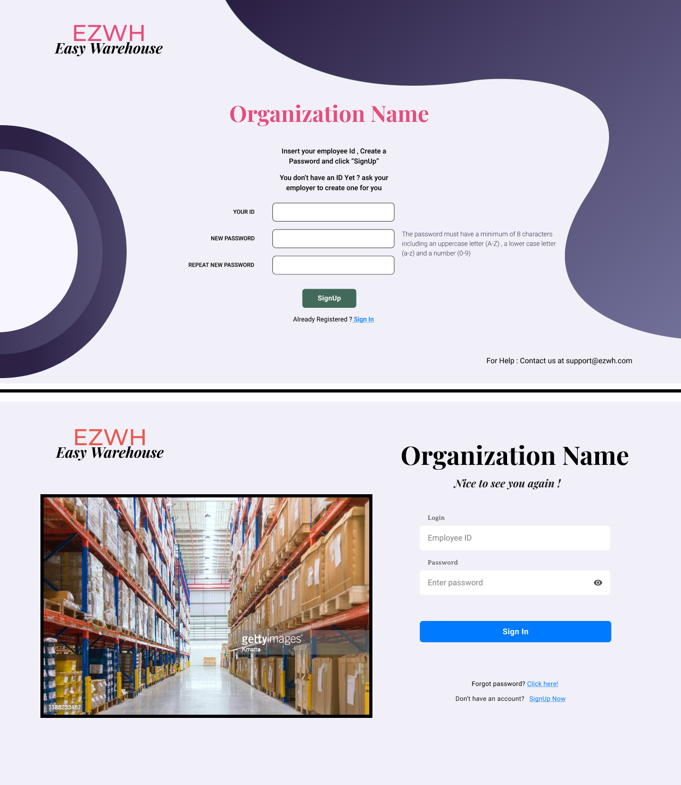
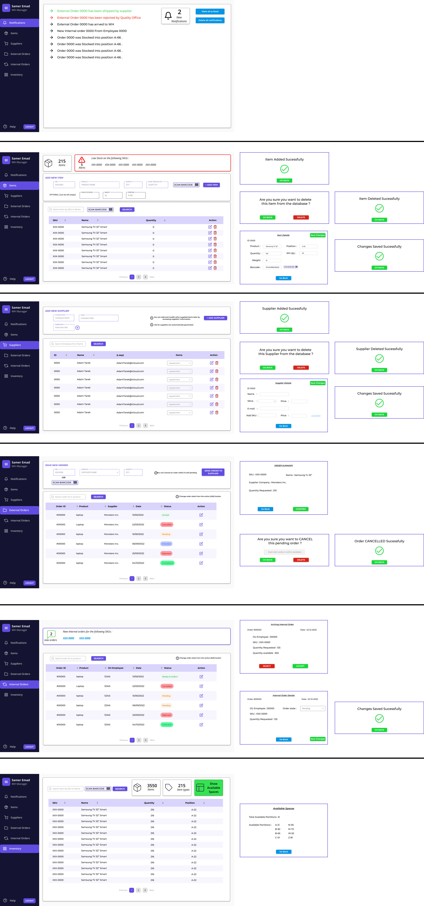
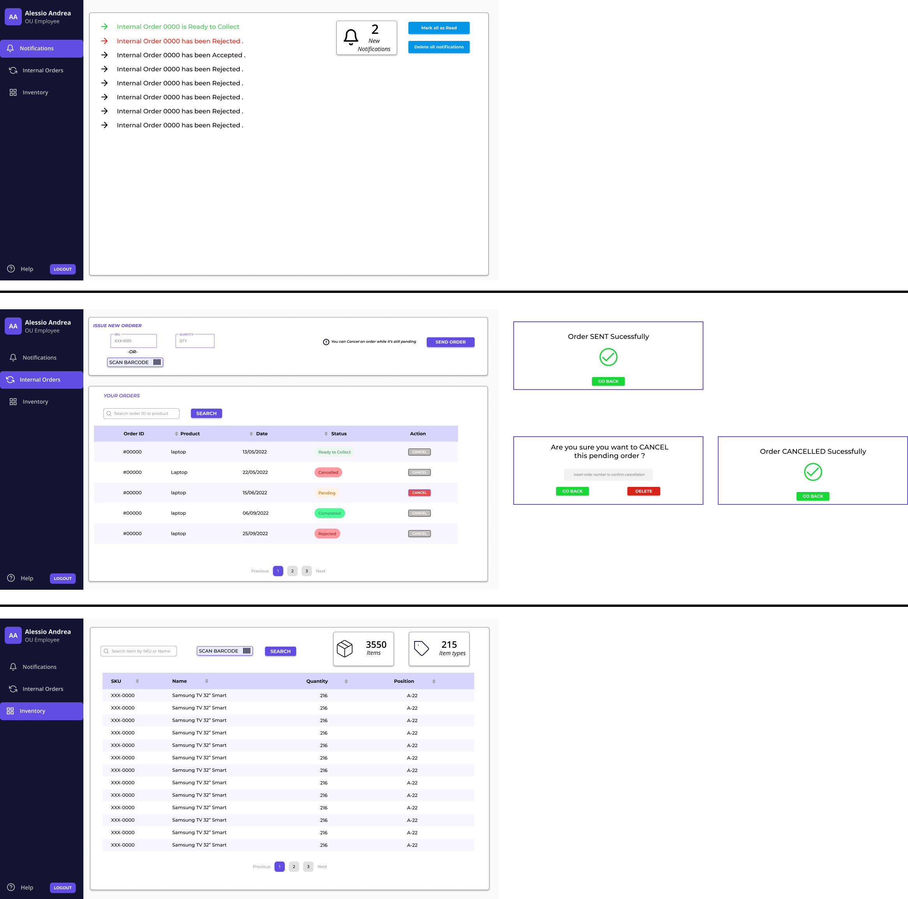
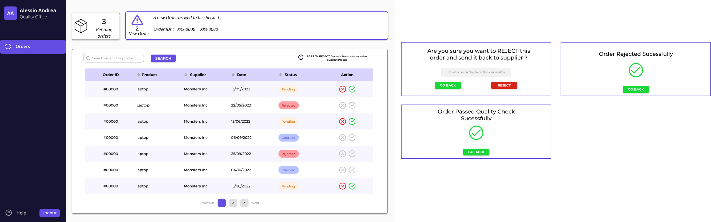

# Graphical User Interface Prototype  

Authors: Abdelrahman SAYED AHMED , Giuseppe D'Andrea , Shayan Taghinezhad Roudbaraki , Giacomo Bruno

Date: 13/04/2022

Version: 2

# Contents

- [Access Pages](#Access-Pages)
- [Admin Interface](#Admin-Interface)
- [Manager Interface](#Manager-Interface)
- [Organizational Unit Interface](#Organizational-Unit-Interface)
- [Quality Office Interface](#Quality-Office-Interface)
- [WH Employee Interface](#WH-Employee-Interface)

# Description
In the file we proposse separately the intefaces introduced for each type of user , depending on their roles already specified by the adminstrator .

## Access Pages

The GUIs for all users' access , either for registration or for successive logins .

## Admin Interface

## Manager Interface

## Organizational Unit Interface

## Quality Office Interface

## WH Employee Interface

