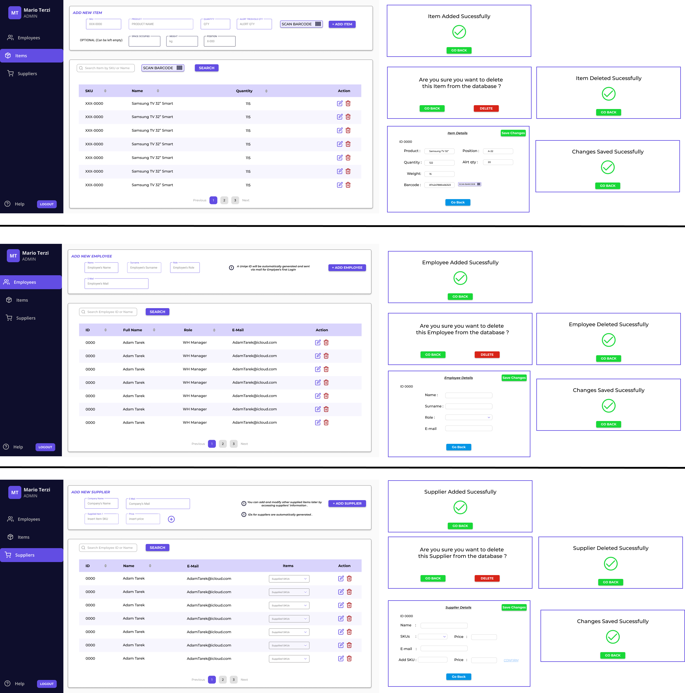
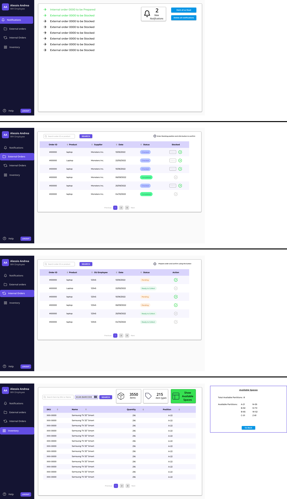

# Graphical User Interface Prototype  

Authors: Abdelrahman SAYED AHMED , Giuseppe D'Andrea , 

Date: 13/04/2022

Version: 1.3

# Description
In the file we proposse separately the intefaces introduced for each type of user , depending on their roles already specified by the adminstrator .

## Access Pages

The GUIs for all users' access , either for registration or for successive logins .

## Admin Interface

## Manager Interface

## Organizational Unit Interface

## Quality Office Interface

## WH Employee Interface

