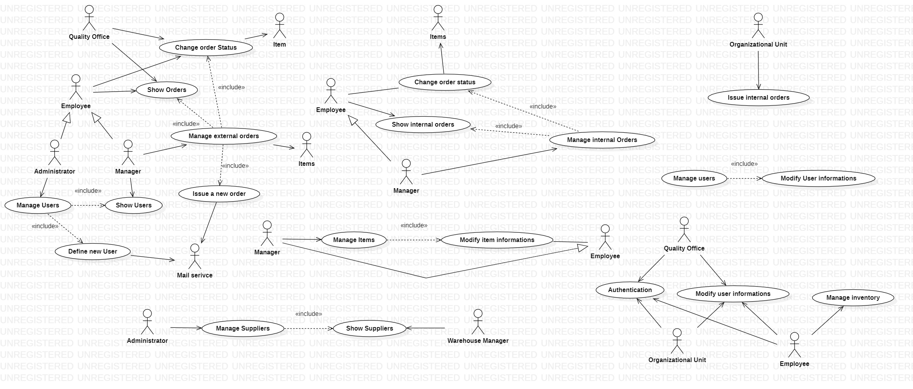
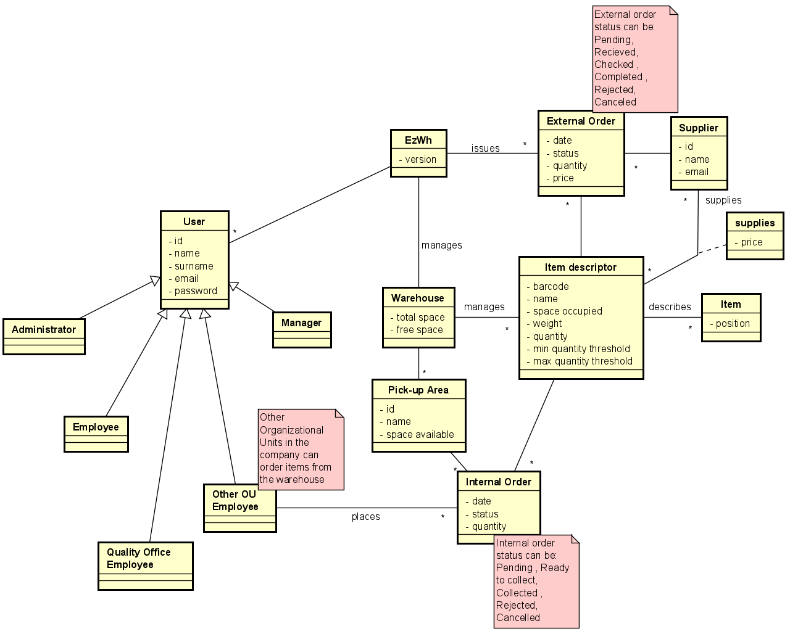

# Requirements Document 

Date: 22 March 2022

Version: 1.7

 
| Version number | Change |
| ----------------- |:-----------|
| 1.1 | Added Stakeholders |
| 1.2 | Added Context Diagram |
| 1.3 | Added Functional Requirments |
| 1.4 | Added Interfaces |
| 1.5 | Added Use Cases | 
| 1.6 | Added Non Functional Requirments |
| 1.7 | Added System Design and Deployment Diagram |


# Contents

- [Informal description](#informal-description)
- [Stakeholders](#stakeholders)
- [Context Diagram and interfaces](#context-diagram-and-interfaces)
	+ [Context Diagram](#context-diagram)
	+ [Interfaces](#interfaces) 
	
- [Stories and personas](#stories-and-personas)
- [Functional and non functional requirements](#functional-and-non-functional-requirements)
	+ [Functional Requirements](#functional-requirements)
	+ [Non functional requirements](#non-functional-requirements)
- [Use case diagram and use cases](#use-case-diagram-and-use-cases)
	+ [Use case diagram](#use-case-diagram)
	+ [Use cases](#use-cases)
    	+ [Relevant scenarios](#relevant-scenarios)
- [Glossary](#glossary)
- [System design](#system-design)
- [Deployment diagram](#deployment-diagram)

# Informal description
Medium companies and retailers need a simple application to manage the relationship with suppliers and the inventory of physical items stocked in a physical warehouse. 
The warehouse is supervised by a manager, who supervises the availability of items. When a certain item is in short supply, the manager issues an order to a supplier. In general the same item can be purchased by many suppliers. The warehouse keeps a list of possible suppliers per item.

After some time the items ordered to a supplier are received. The items must be quality checked and stored in specific positions in the warehouse. The quality check is performed by specific roles (quality office), who apply specific tests for item (different items are tested differently). Possibly the tests are not made at all, or made randomly on some of the items received. If an item does not pass a quality test it may be rejected and sent back to the supplier. 

Storage of items in the warehouse must take into account the availability of physical space in the warehouse. Further the position of items must be traced to guide later recollection of them.

The warehouse is part of a company. Other organizational units (OU) of the company may ask for items in the warehouse. This is implemented via internal orders, received by the warehouse. Upon reception of an internal order the warehouse must collect the requested item(s), prepare them and deliver them to a pick up area. When the item is collected by the other OU the internal order is completed. 

EZWH (EaSy WareHouse) is a software application to support the management of a warehouse.


# Stakeholders


| Stakeholder name  | Description | 
| ----------------- |:-----------:|
|   Medium company    	 | The company interested in using the software EzWh  |
|   Suppliers		   	 | Vendors or entities that provide items to the company |
|   Inventory            | The physical space used to store recived items  |  
|   Warehouse manager 	 | An Employee who manages the warehouse and supervises the availability of items |
|   Administator         | Person who installs the application,  mantains it, defines users and assign privileges |
|   Quality office 		 | Employees that applied specific tests for item, and reject them if they don't pass the check |
|   Organizational units | Other Internal company employees that can make internal orders |
|   Warehouse employees  | Employees who receive orders and items and manage them |
|   Competitors		     | Other SWs for warehouse management |
|   Items                | Objects stored in the warehouse and requested in orders |
|   Mail Service         | Service used to contact suppliers for requesting new orders |

# Context Diagram and interfaces

## Context Diagram

```plantuml
left to right direction
skinparam actorStyle awesome

actor Employee as E
actor Adminstrator as A
actor "Organizational unit" as OU
actor "Quality Office" as QO
actor "Mail Service" as W
actor Item as I
actor Manager as M

rectangle System{
(EzWh) as EzWH
}
E -- EzWH
A --|> E
M --|> E
QO -- EzWH
OU -- EzWH
I -- EzWH
EzWH -- W
```

## Interfaces

|	     Actor   		| Logical Interface | Physical Interface  |
| --------------------- |:---------------------------------------------:| -------------------------:|
|  Employee - Quality Office - Organizational Unit - Administrator - Manager	|  GUI	| Keyboard , Mouse, Screen , Mobile Device 	|
|  Items			                | Function (ReadBarcode )   | Barcode reader, Mobile Device | 
|  Mail service 					| API - Mail Protocols		| Internet Connection | 


# Stories and personas

## Persona 1 - Administrator
Administrator, 38yo, degree in IT field, some years of experience in medium companies and high technical skills.

His job in the company is to keep the servers up and running, keep them updated and resolve problems as soon as they presents. He can manage users and privileges in the system.

## Persona 2 - Warehouse manager
Warehouse manager, 45yo, married, works for the company from 7 years.

The warehouse manager every morning arrives in the office and has to check for low stock items to order from supplier. During the day he receive notifications about low stock products in the inventory.

He can also receive items from quality office that didn't pass quality checks. He has to issue the return to the supplier and assign the items to warehouse employees to prepare them for the shipment.

## Persona 3 - Quality office employee
Quality office employee, 40yo, female, mother of 2, never missed a day of work.

Quality office employee should make sure that the items received pass some quality checks before storing them in the warehouse.
Upon receiving an order quality office employee has to perform some checks on the item and submit the results.

If the items pass the quality check, she notifies warehouse employee to store them in the warehouse; otherwise warehouse manager is notified to issue a return to the supplier.

## Persona 4 - Warehouse employee
Warehouse employee, 30yo, male, doesn't have problems with physical work.

Warehouse employees have to store items that passed quality checks. When a positive quality check result is received from quality office, warehouse employee have to store the items in the warehouse and submit their position.

They can also receive orders from other OUs. Upon receiving the order they have to collect the items in the warehouse and have them delivered to a pick-up area.

## Persona 5 - Organizational Unit
Organizational Unit employee, 32yo, female, her work let her spend a lot of time on the phone, high social skills.

Organizational Units can order items from the warehouse and collect them from a pick-up area.


# Functional and non functional requirements

## Functional Requirements

| ID        | Description  |
| ------------- |:-------------:| 
| FR 1     |  Manage users and rights |
| 	FR 1.1 	| Define new user |
| 	FR 1.2 	| Delete a user |
| 	FR 1.3 	| List all users   |
| 	FR 1.4 	| Search a user   |
| 	FR 1.5	| Modify User Information |
|  												|  								|
|  												|  								|
|  												|  								|
| 	FR 2 	| User's Authentication and functionalities |
| 	FR 2.1 	|  Authenticate user  |
| 	FR 2.2	|  Change Password  |
|  												|  								|
|  												|  								|
|  												|  								|
| FR 3	  | Manage Items |
| 	FR 3.1 	| Create a new item |
| 	FR 3.2 	| Search item  |
| 	FR 3.1 	| Modify item properties |
| 	FR 3.2 	| Show Item Information |
| 	FR 3.3 	| Issue stock threshold warning for a item type|
| 	FR 3.4 	| List all items|
| 	FR 3.5 	| Delete Item|
|  												|  								|
|  												|  								|
|  												|  								|
| FR 4   | Manage External Orders|
|	FR 4.1 	| Issue an order |
| 	FR 4.2 	| List all orders (Pending, Recieved, Checked , Completed , Rejected, Cancelled) |
| 	FR 4.3 	| Search an order |
| 	FR 4.4 	| Show order details |
| 	FR 4.5 	| Cancel a pending order (Cancelled) |
| 	FR 4.6 	| Change order state to (Recieved)  |
| 	FR 4.7 	| Change order state to (Checked)  |
| 	FR 4.8 	| Stock order into specific position (Completed) |
| 	FR 4.9  | Reject order and send back (Rejected) |
|  												|  								|
|  												|  								|
|  												|  								|
| FR 5   | Manage suppliers |
|	FR 5.1 	| Create or modify a supplier |
| 	FR 5.2	| Delete a supplier  |
|	FR 5.3	| Search suppliers  |
| 	FR 5.4 	| List  all suppliers  |
| 	FR 5.5 	| List  all supplied items for a supplier  |
|  												|  								|
|  												|  								|
|  												|  								|
| FR 6 	| Manage Inventory  |
| 	FR 6.1 	| Show Inventrory overview  |
| 	FR 6.2 	| Edit Inventrory total space  |
| 	FR 6.3 	| Show Available spaces |
|  												|  								|
|  												|  								|
|  												|  								|
| FR 7	| Manage Internal Order  |
| 	FR 7.1	| Notify for arriving order  |
| 	FR 7.2	| Check items availabilty and position  |
| 	FR 7.3	| Accept / Reject Order   |
| 	FR 7.4	| Show all internal ordres   |
| 	FR 7.5	| Search internal order   |
| 	FR 7.6	| Change order State (Pending , Ready to collect , Collected , Rejected, Cancelled)  |
|  												|  								|
|  												|  								|
|  												|  								|
| FR 8	| Place Internal Orders  |
|	FR 8.1 	| Issue an internal order |
| 	FR 8.2	| Show items availabilty  |
| 	FR 8.3	| Cancel an internal order   |


## Non Functional Requirements

| ID        | Type (efficiency, reliability, ..)  | Description  | Refers to |
| ------------- |:-------------:| :-----:| -----:|
|  NFR1     |  Usability |  Users should be able to use the software with 2 hours training | All FR |
|  NFR2     |  Efficiency  |  Software should provide response in less than 0.5s | All FR |
|  NFR3 	|  Reliability  |  Software should not have more than 4 days of downtime every year | All FR |
|  NFR4 	|  Portability  | Backend software should run on Windows/Linux | All FR |
|  NFR5		|  Portability  | Frontend should run on Chrome, Firefox, Edge and Safari | All FR |
|  NFR6		|  Mantainability  | Software can be reinstalled in another machine with a backup | All FR |
|  NFR7 	|  Security  |  Block login for 1 hour after 5 wrong login | FR2.1 Authenticate user |
|  NFR8 	|  Security  |  Only authorized users can access system functions and information | All FR |
|  NFR9 	|  Safety  |  Items should have the correct weight and volume for the space assigned | FR4.9 Stock order into specific position |


# Use case diagram and use cases


## Use case diagram



### Use case 1, UC1: Authentication
| Actors Involved        | User |
| ------------ |:-------------:| 
|  Precondition     | User registered (or not) && User not authenticated |
|  Post condition     | User authenticated and authorized || User not authenticated |
|  Nominal Scenario     | User authention is correct, First Login, Logout |
|  Variants     | User authentication is correct and user has to change the password |
|  Exceptions     | User authentication failed |

##### Scenario 1.1 

| Scenario 1.1 | User athentication is correct |
| ------------- |:-------------:| 
|  Precondition     | User U registered && User U not authenticated |
|  Post condition   | User U authenticated and authorized |
| Step#       	    | Description  |
|  1     | User U wants to access to the system |  
|  2     | System asks for username and password |
|  3     | User U inserts username and password |
|  4     | System verifies the credentials   |
|  5     | Credentials are valid, user is authenticated |

##### Scenario 1.2

| Scenario 1.2 | User athentication is correct and user has to change the password|
| ------------- |:-------------:| 
|  Precondition     | User U registered && User U not authenticated |
|  Post condition   | User U authenticated and authorized && user U has a new password |
| Step#       	    | Description  |
|  1     | User U wants to access the system |  
|  2     | System asks for username and password |
|  3     | User U inserts username and password |
|  4     | System verifies the credentials   |
|  5     | Credentials are valid, user is authenticated |
|  6     | Password has expired |
|  7     | System asks for the new password |
|  8     | User U inserts new password |
|  9     | Password is updated    |

##### Scenario 1.3

| Scenario 1.3 | User athentication is failed |
| ------------- |:-------------:| 
|  Precondition     | User U registered && User U not authenticated |
|  Post condition   | User U not authenticated |
| Step#       	    | Description  |
|  1     | User U wants to access to the system |  
|  2     | System asks for username and password |
|  3     | User U inserts username and password |
|  4     | System verifies the credential   |
|  5     | Credentials are not valid, user is not authenticated |

##### Scenario 1.4

| Scenario 1.4 | First Login |
| ------------- |:-------------:| 
|  Precondition     | User U registered && User U without password |
|  Post condition   | User U authenticated && User with new password |
| Step#       	    | Description  |
|  1     | User U wants to access to the system for the first time |
|  2     | User U receives an email, clicks on the link |  
|  3     | System asks for a new password |
|  4     | User insert new password |
|  5     | New password is inserted in the system && user is authenticated |

##### Scenario 1.5 
| Scenario 1.5 | Logout |
| ------------- |:-------------:| 
|  Precondition     | User U registered && User U authenticated |
|  Post condition   | User U not authenticated |
| Step#       	    | Description  |
|  1     | User U wants to log out from the system |
|  2     | System terminates user's session |  

### Use case 2, UC2: Manage users
| Actors Involved        | Administrator, user |
| ------------- |:-------------:| 
|  Precondition     | Administrator is authenticated && user is registered (or not) into the system|
|  Post condition   | User information are inserted/modified/deleted  |
|  Nominal Scenario     | Create user, Modify user information, Delete user, Show users |
|  Variants     | Administrator modifies user info  |
|  Exceptions     |  |

##### Scenario 2.1 

| Scenario 2.1 | Create user |
| ------------- |:-------------:| 
|  Precondition     | Administrator is authenticated && user non registered|
|  Post condition   | New user can insert his/her new password |
| Step#       	    | Description  |
|  1     | Administrator creates new account for the user with information and privileges |  
|  2     | The system sends an email to the user for inserting the new password  |

##### Scenario 2.2

| Scenario 2.2 | Administrator modifies user information |
| ------------- |:-------------:| 
|  Precondition     | Administrator is authenticated && user is registered into the system |
|  Post condition   | Administrator has modified user information |
| Step#       	    | Description  |
|  1     | Administrator wants to modify user information  |  
|  2     | The system shows user information  |
|  3     | Administrator modifies some/all of the information |

##### Scenario 2.3

| Scenario 2.3 | User modifies his/her information |
| ------------- |:-------------:| 
|  Precondition     | User U is authenticated |
|  Post condition   | User U has modified his/her information |
| Step#       	    | Description  |
|  1     | User U wants to modify his/her information |  
|  2     | The system shows information that can be modified  |
|  3     | User U modifies some/all of the information |

##### Scenario 2.4

| Scenario 2.4 |  Delete user |
| ------------- |:-------------:| 
|  Precondition     | administrator is authenticated && user is registered into the system |
|  Post condition   | User is deleted from the system |
| Step#       	    | Description  |
|  1     | Administrator searches for user U  |  
|  2     | Administrator deletes user U from the system  |


### Use case 3, UC3: Manage item
| Actors Involved        | User, item |
| ------------ |:-------------:| 
|  Precondition     | user is authenticated && item is not (or is) present in the system |
|  Post condition     | Item descriptor is inserted/modified/deleted |
|  Nominal Scenario     | Insert new item descriptor, Modify item descriptor, Delete item descriptor, Show item descriptor |
|  Variants     |  Modify item descriptor - alarm |
|  Exceptions     | Insert new item descriptor - failure, Modify item descriptor - failure, delete item descriptor - failure |

##### Scenario 3.1

| Scenario 3.1 |  Insert new item descriptor |
| ------------- |:-------------:| 
|  Precondition     | WH manager is authenticated && item descriptor is not present in the system |
|  Post condition   | Item descriptor is inserted in the system |
| Step#       	    | Description  |
|  1     |  WH manager inserts new item descriptor I and its information in the system  |  

##### Scenario 3.2

| Scenario 3.2 |  Insert new item descriptor - failure |
| ------------- |:-------------:| 
|  Precondition     | WH manager is authenticated && item descriptor is present in the system |
|  Post condition   | Item descriptor is not inserted in the system |
| Step#       	    | Description  |
|  1     | WH manager inserts new item descriptor I and its information in the system  |  
|  2     | Item descriptor is already present in the system and the operation is aborted |


##### Scenario 3.3 

| Scenario 3.3 | Moodify item descriptor |
| ------------- |:-------------:| 
|  Precondition     | user is authenticated && Item descriptor is present in the system |
|  Post condition   | Item descriptor is modified |
| Step#       	    | Description  |
|  1     | User accesses the item descriptor that wants to modified |
|  2     | System shows to user the information that he/she can modify |
|  2     | User modifies some/all of the information  |
|  3     | Item descriptor is successfully modified |

##### Scenario 3.4

| Scenario 3.4 | Modify item descriptor - failure  |
| ------------- |:-------------:| 
|  Precondition     | user is authenticated && Item descriptor is present in the system |
|  Post condition   | Items descriptor is not modified |
| Step#       	    | Description  |
|  1     | User accesses the item descriptor that wants to modified |
|  2     | System shows to user the information that he/she can modify | 
|  2     | User modifies some/all of item information  |
|  3     | Item information is wrong (quantity < 0, NaN, ...) so the operation is aborted |

##### Scenario 3.5

| Scenario 3.5 | Modify item descriptor - alarm  |
| ------------- |:-------------:| 
|  Precondition     | user is authenticated && Item descriptor is present in the system |
|  Post condition   | Items descriptor is not modified && a notification is sent to WH manager |
| Step#       	    | Description  |
|  1     | User accesses the item descriptor that wants to modified |
|  2     | System shows to user the information that he/she can modify | 
|  2     | User modifies the some/all of item information  |
|  3     | Item information is below the threshold so the system notifies the WH manager |

##### Scenario 3.6 

| Scenario 3.6 | Delete item descriptor |
| ------------- |:-------------:| 
|  Precondition     | WH manager is authenticated && Item descriptor is not present in the inventory |
|  Post condition   | Item descriptor is deleted from the system |
| Step#       	    | Description  |
|  1     | WH manager searches for the item descriptor to delete  |  
|  2     | Item descriptor is deleted  |

##### Scenario 3.7

| Scenario 3.7 | Delete item descriptor - failure |
| ------------- |:-------------:| 
|  Precondition     | WH manager is authenticated && Items are present in the inventory |
|  Post condition   | Item descriptor is not deleted from the system |
| Step#       	    | Description  |
|  1     | WH manager searches for the item descriptor to delete  |  
|  2     | WH manager tries to delete the item descriptor |
|  3     | System stops the operation because the items are still present in the inventory |

### Use case 4, UC4: Manage external oreder 
| Actors Involved        | User, item , mail service |
| ------------ |:-------------:| 
|  Precondition     | user is authenticated && all item are present in the system |
|  Post condition     | External Order is created/modified/deleted |
|  Nominal Scenario     | Create external order, Modify external order status into received, Modify external order status into cancelled, show external orders |
|  Variants     |  Modify external order status into checked, Modify external order status into completed, Modify external order status into rejected |
|  Exceptions     |  |

##### Scenario 4.1

| Scenario 4.1 |  Create external order |
| ------------- |:-------------:| 
|  Precondition     | WH manager is authenticated && WH manager has received a notification of low quantity for a certain item |
|  Post condition   | A new order to the supplier is created via mail && order status is pending |
| Step#       	    | Description  |
|  1     | System shows the list of item to be ordered and their information to the WH manager |  
|  2     | For each item descriptor the WH manager chooses the supplier from item descriptor's list and quantity to be ordered | 
|  3     | WH manager inserts these information in a new order |
|  4     | The order is sent by email to supplier and the order state is set to pending |

##### Scenario 4.2

| Scenario 4.2 | Modify external order status into received |
| ------------- |:-------------:| 
|  Precondition     | WH employee is authenticated && items have arrived in the warehouse && order status is pending |
|  Post condition   | A notification to the QO is sent && order status is received |
| Step#       	    | Description  |
|  1     |  When items arrive in the warehouse, WH employee sets order status to received  |  
|  2     |  The system notifies the QO employee | 

##### Scenario 4.3

| Scenario 4.3 | Modify external order status into checked | 
| ------------- |:-------------:| 
|  Precondition     | QO employee is authenticated && QO employee has received a notification && order status is received  |
|  Post condition   | A notification to the WH employee is sent && order status is checked |
| Step#       	    | Description  |
|  1     |  QO employee decides if and which items should be tested  |  
|  3     |  All tested items pass the tests, so the QO employee change order status into checked |
|  4     |  System sends a notification to WH employee |

##### Scenario 4.4

| Scenario 4.4 | Modify external order status into rejected |
| ------------- |:-------------:| 
|  Precondition     | QO employee is authenticated && QO employee has received a notification && order status is received |
|  Post condition   | A notification to the WH manager is sent && order status is rejected |
| Step#       	    | Description  |
|  1     | QO employee decides if and which items should be tested  |  
|  3     | Some items do not pass the tests, so the QO employee changes order status to rejected |
|  4     | System sends a notification to the WH manager |
|  5     | WH manager starts procedure to reject order |

##### Scenario 4.5

| Scenario 4.5 | Modify external order status into completed |
| ------------- |:-------------:| 
|  Precondition     | WH employee is authenticated && WH employee has received a notification && order status is checked |
|  Post condition   | A notification to the WH manager is sent && order status is completed && item quantity is updated |
| Step#       	    | Description  |
|  1     |  WH emplyee through the mobile device reads item barcode and the system updates quantity in item descriptor |  
|  2     |  When all the items are placed in the warehouse, the WH employee set order status to completed |
|  4     |  System sends a notification to warehouse manager |

##### Scenario 4.6

| Scenario 4.6 | Modify external order status into cancelled |
| ------------- |:-------------:| 
|  Precondition     | WH manager is authenticated && Order status is pending |
|  Post condition   | Email is sent to Supplier && Order status is cancelled |
| Step#       	    | Description  |
|  1     | WH manager M accesses order info  |  
|  2     | WH manager M deletes order |
|  3     | System sends an email to supplier and sets order status as cancelled |

### Use case 5, UC5: Manage inventory 
| Actors Involved        | User, item, inventory |
| ------------ |:-------------:| 
|  Precondition     | user is authenticated |
|  Post condition     | -  |
|  Nominal Scenario     | Show inventory |
|  Variants     |  |
|  Exceptions     |  |

##### Scenario 5.1

| Scenario 5.1 |  Show inventory |
| ------------- |:-------------:| 
|  Precondition     | user is authenticated |
|  Post condition   | - |
| Step#       	    | Description  |
|  1     |  User asks to look at the inventory map  |  
|  2     |  System shows him/her the map with all of the items | 


### Use case 6, UC6: Issue Internal Order 
| Actors Involved        | OU employee, item, WH manager, WH employee |
| ------------ |:-------------:| 
|  Precondition     | users are authenticated && items are present in the warehouse |
|  Post condition     | Internal order is created/cancelled/shown |
|  Nominal Scenario     | Create internal order,  cancel internal order, show internal orders per OU employee |
|  Variants     |   |
|  Exceptions     | |

##### Scenario 6.1

| Scenario 6.1 |  Create internal order |
| ------------- |:-------------:| 
|  Precondition     | OU employee is authenticated && items are in the warehouse|
|  Post condition   | New internal order is created && WH manager receives a notification by the system |
| Step#       	    | Description  |
|  1     |  OU employee wants to create a new order  |  
|  2     |  System shows him/her items that are in the inventory with their quantities | 
|  3     |  OU employee adds item to a new order with its quantity |
|  4     |  Operation is completed successfully, the order is created and a notification is sent to WH manager |

##### Scenario 6.2

| Scenario 6.2 |  Cancel internal order |
| ------------- |:-------------:| 
|  Precondition     | OU employee is authenticated && the order is present in the system && order status is pending |
|  Post condition   | Internal order is cancelled && WH employee/manager receive a notification by the system |
| Step#       	    | Description  |
|  1     |  OU employee wants to cancel an order  |  
|  2     |  System shows his/her orders that are in the system with status pending | 
|  3     |  OU employee cancels the selected orders |
|  4     |  Operation is completed successfully, the order status is set to cancelled and a notification is sent to WH employee/manager |

### Use case 7, UC7: Manage Internal Order
| Actors Involved        | item, WH manager, WH employee, OU employee |
| ------------ |:-------------:| 
|  Precondition     | users are authenticated && items are present in the warehouse && order is in the system|
|  Post condition     | Internal order status is modified (or not) |
|  Nominal Scenario     | Modify internal order status into (Pending, Ready to collect , Collected , Rejected, Cancelled), show internal orders |
|  Variants     |   |
|  Exceptions     |    |

##### Scenario 7.1

| Scenario 7.1 |  Modify internal order status into Ready to collect |
| ------------- |:-------------:| 
|  Precondition     | WH employee is authenticated && items are in the warehouse && order status is pending|
|  Post condition   | Order status is ready to collect && item quantities are modified && OU employee receives a notification |
| Step#       	    | Description  |
|  1     |  WH employee receives a notification for a new pending order  |  
|  2     |  System shows him/her item that is in the order with its quantity and position | 
|  3     |  WH employee collect items and reads their barcode with mobile device |
|  4     |  System updates items quantities |
|  5     |  When all items are collected and the order is prepared, WH employee sends items to pick up area|
|  6     |  WH employee set order status as ready to collect |
|  7     |  System sends a notitfication to OU employee |

##### Scenario 7.2

| Scenario 7.2 |  Modidfy internal order status into collected |
| ------------- |:-------------:| 
|  Precondition     | OU employees E1 and E2 are authenticated && order status is ready to collect |
|  Post condition   | Order status is collected |
| Step#       	    | Description  |
|  1     |  OU employee E2 receives a notification for a "ready to collect" order  |  
|  2     |  OU employee E1 identifies E2 and OU employee E2 collect the order from the pick up area | 
|  3     |  OU employee E1 set order status as collected |

##### Scenario 7.3

| Scenario 7.3 |  Modidfy internal order status into rejected |
| ------------- |:-------------:| 
|  Precondition     | WH manager is authenticated && internal order is in the system |
|  Post condition   | Order status is rejected |
| Step#       	    | Description  |
|  1     |  An error occurs during internal order processing (e.g item quantity isn't present in the warehouse)  |  
|  2     |  WH manager sets internal order status as rejected | 
|  3     |  System sends notifications to WH employee and OU employee |

##### Scenario 7.4

| Scenario 7.4 |  Modidfy internal order status into pending |
| ------------- |:-------------:| 
|  Precondition     | WH manager is authenticated && new internal order is in the system |
|  Post condition   | A notification is sent to Wh employee && order status is pending |
| Step#       	    | Description  |
|  1     |  WH manager receives a notification for a new internal order  |  
|  2     |  WH manager accept the order && order status is set to pending | 
|  3     |  System sends notifications to WH employee |

### Use case 8, UC8: Manage suppliers
| Actors Involved        | Administrator |
| ------------- |:-------------:| 
|  Precondition     | Administrator is authenticated |
|  Post condition   | Suppliers information are inserted/modified/deleted  |
|  Nominal Scenario     | Create supplier, Modify supplier information, Delete supplier, Show suppliers |
|  Variants     |  Show suppliers per item  |
|  Exceptions     |  |

##### Scenario 8.1 

| Scenario 8.1 | Create supplier |
| ------------- |:-------------:| 
|  Precondition     | Administrator is authenticated && supplier is not registered into the system|
|  Post condition   | Supplier inserted in the system |
| Step#       	    | Description  |
|  1     | Administrator inserts new supplier in the system with his/her information |  

##### Scenario 8.2

| Scenario 8.2 | Administrator modify supplier information |
| ------------- |:-------------:| 
|  Precondition     | Administrator is authenticated && supplier is registered into the system |
|  Post condition   | Administrator has modified supplier information |
| Step#       	    | Description  |
|  1     | Administrator wants to modify supplier information  |  
|  2     | System shows supplier information  |
|  3     | Administrator modifies the information that he/she chooses |

##### Scenario 8.3

| Scenario 8.3 |  Delete supplier |
| ------------- |:-------------:| 
|  Precondition     | administrator is authenticated && supplier is registered into the system |
|  Post condition   | Supplier is deleted from the system |
| Step#       	    | Description  |
|  1     | Administrator searches for supplier S  |  
|  2     | Administrator deletes S from the system  |

##### Scenario 8.4 

| Scenario 8.4 |  Show suppliers per item descriptor |
| ------------- |:-------------:| 
|  Precondition     | WH manager is authenticated && item descriptor is present into the system |
|  Post condition   | -- |
| Step#       	    | Description  |
|  1     |  WH manager searches for item descriptor I  |  
|  2     | 	The system shows item information with list of all suppliers of the item  |


# Glossary




# System Design


# Deployment Diagram 


