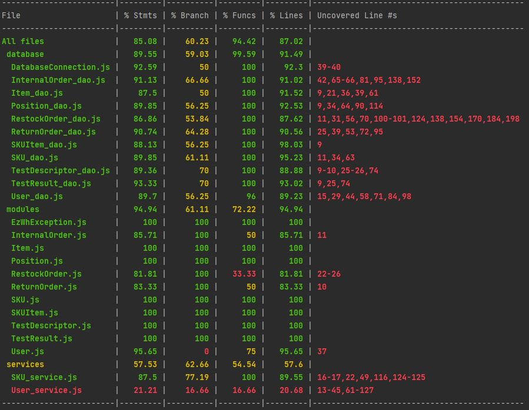

# Unit Testing Report

Date: 2022/05/25

Version: 1.0

# Contents

- [White Box Unit Tests](#white-box-unit-tests)

# White Box Unit Tests

### Test cases definition

N.B : Tests should be run using `--runInBand` in the `npm test` to avoid parallel tests and causing faulty access order of tests to database .

| Class name         | Unit name                                | Jest File          | Jest test case                                                           |
|--------------------|------------------------------------------|--------------------|--------------------------------------------------------------------------|
| SKU_dao            | getSKUs                                  | SKU_dao            | Get all SKUs                                                             |
|                    | getTestDescriptorsBySKUID                | SKU_dao            | Get test descriptors of SKUID :skuid                                     |
|                    | createSKU                                | SKU_dao            | Create SKU                                                               |
|                    | getSKUById                               | SKU_dao            | Get SKU by ID :skuid                                                     |
|                    | modifySKU                                | SKU_dao            | Modify SKU :skuid                                                        |
|                    | addSKUPosition                           | SKU_dao            | Add position :positionid to SKU :skuid                                   |
|                    | deleteSKU                                | SKU_dao            | Delete SKU :skuid                                                        |
|                    |                                          |                    |                                                                          |
| SKUItem_dao        | getSKUItems                              | SKUItem_dao        | Get all SKUItems                                                         |
|                    | getSKUItemsBySKU                         | SKUItem_dao        | Get SKUItems for SKUID :skuid                                            |
|                    | getSKUItemByRfid                         | SKUItem_dao        | Get SKUItem by RFID :rfid                                                |
|                    | createSKUItem                            | SKUItem_dao        | Create SKUItem :rfid                                                     |
|                    | modifySKUItem                            | SKUItem_dao        | Modify SKUItem :rfid                                                     |
|                    | deleteSKUItem                            | SKUItem_dao        | Delete SKUItem :rfid                                                     |
|                    |                                          |                    |                                                                          |
| Position_dao       | getPositions                             | Position_dao       | Get all Positions                                                        |
|                    | getPositionByID                          | Position_dao       | Get Position by ID :positionid                                           |
|                    | createPosition                           | Position_dao       | Create Position :positionid                                              |
|                    | modifyPosition                           | Position_dao       | Modify Position Info :positionid                                         |
|                    | modifySKUPosition                        | Position_dao       | Modify SKU :skuid assigned Position :positionid                          |
|                    | modifyPositionID                         | Position_dao       | Modify Position ID :positionid                                           |
|                    | deletePosition                           | Position_dao       | Delete Position :positionid                                              |
|                    |                                          |                    |                                                                          |
| InternalOrder_dao  | getInternalOrders                        | InternalOrder_dao  | Get InternalOrders with state=:state                                     |
|                    | getInternalOrderByID                     | InternalOrder_dao  | **Modify InternalOrder :id to state :state                               |
|                    | getInternalOrderProductByInternalOrderID | InternalOrder_dao  | **Create InternalOrder                                                   |
|                    | getInternalOrderSKUItemByInternalOrderID | InternalOrder_dao  | **Modify InternalOrder :id to state :state                               |
|                    | createInternalOrder                      | InternalOrder_dao  | Create InternalOrder                                                     |
|                    | createInternalOrderProduct               | InternalOrder_dao  | **Create InternalOrder                                                   |
|                    | createInternalOrderSKUItem               | InternalOrder_dao  | **Modify InternalOrder :id to state :state                               |
|                    | modifyInternalOrderState                 | InternalOrder_dao  | Modify InternalOrder :id to state :state                                 |
|                    | deleteInternalOrder                      | InternalOrder_dao  | Delete InternalOrder :id                                                 |
|                    |                                          |                    |                                                                          |
| User_dao           | getUsers                                 | User_dao           | Get all Users                                                            |
|                    | getSuppliers                             | User_dao           | Get all Suppliers                                                        |
|                    | getUserByEmail                           | User_dao           | Get User :email                                                          |
|                    | getUserByID                              | User_dao           | **Create User :type :email                                               |
|                    | createUser                               | User_dao           | Create User :type :email                                                 |
|                    | modifyUserRights                         | User_dao           | Modify User :type :email to :newType                                     |
|                    | deleteUser                               | User_dao           | Delete User :type :email                                                 |
|                    |                                          |                    |                                                                          |
| Item_dao           | getItems                                 | Item_dao           | Get All Items                                                            |
|                    | getItemByIDAndSupplierID                 | Item_dao           | GET Item by ID :id                                                       |
|                    | getItemBySKUIDAndSupplierID              | Item_dao           | Get Item by supplier :supplierid and SKUID :skuid                        |
|                    | createItem                               | Item_dao           | Create Item :itemid                                                      |
|                    | modifyItem                               | Item_dao           | Modify Item :id                                                          |
|                    | deleteItem                               | Item_dao           | Delete Item :id                                                          |
|                    |                                          |                    |                                                                          |
| RestockOrder_dao   | getRestockOrders 						                  | RestockOrder_dao 	 | Get all Restock Orders                                                   |
| 					 | getRestockOrderByID					                 | RestockOrder_dao   | Create and Get By ID  { issueDate: :issueDate, supplierId: :supplierId } |
| 					 | getRestockOrderByID					                 | RestockOrder_dao   | Delete and Get By ID { restockOrderID: :id }                             |
| 					 | getRestockOrderByID                      | RestockOrder_dao   | Modify State { restockOrderID: :id }                                     |
| 					 | getRestockOrderByID                      | RestockOrder_dao   | Add transport note { restockOrderID : :id }                              |
| 					 | getRestockOrderProductsByRestockOrderID  | RestockOrder_dao   | Restock Order Product, Create and Get By ID { SKUId: :SKUId }            |
| 					 | getRestockOrderSKUItemsByRestockOrderID  | RestockOrder_dao   | Restock Order SKUItem, Create and Get By ID { RFID:  :RFID }             |
| 					 | getRestockOrderReturnItems			            | RestockOrder_dao   | Get Restock Order return Items  { restockOrderID : ${restockOrder.id} }  |
| 					 | createRestockOrder    	                  | RestockOrder_dao   | Create and Get By ID  { issueDate: :issueDate, supplierId: :supplierId } |
| 					 | createRestockOrderProduct	               | RestockOrder_dao   | Restock Order Product, Create and Get By ID { SKUId: :SKUId }            |
| 					 | modifyRestockOrderState                  | RestockOrder_dao   | Modify State { restockOrderID : :id }                                    |
| 					 | addSkuItemToRestockOrder  	              | RestockOrder_dao   | Restock Order SKUItem, Create and Get By ID { RFID:  :RFID }             |
| 					 | addTransportNoteToRestockOrder	          | RestockOrder_dao   | Add transport note { restockOrderID: :id }                               |
| 					 | deleteRestockOrder  	                    | RestockOrder_dao   | Delete and Get By ID { restockOrderID: :id }                             |
| 					 | 									                                | 			         | 				                                                            |
| ReturnOrder_dao	 | createReturnOrder		                      | ReturnOrder_dao    | create returnOrder                                                       |
| 					 | createReturnOrder					                   | ReturnOrder_dao    | create returnOrder with error                                            |
| 					 | createReturnOrderProducts			             | ReturnOrder_dao    | create returnOrder product                                               |
| 					 | createReturnOrderProducts			             | ReturnOrder_dao    | create returnOrder product with error                                    |
| 					 | getReturnOrderProducts				               | ReturnOrder_dao    | create returnOrder product                                               |
| 					 | getReturnOrderProducts			                | ReturnOrder_dao    | get returnOrder products of retOrd :id                                   |
| 					 | getReturnOrders		                        | ReturnOrder_dao    | get all return orders                                                    |
| 					 | getReturnOrderByID				                   | ReturnOrder_dao    | create returnOrder                                                       |
| 					 | getReturnOrderByID					                  | ReturnOrder_dao	 | get return order with id=:id                                             |
| 					 | getReturnOrderByID					                  | ReturnOrder_dao    | delete return order with id=:id                                          |
| 					 | deleteReturnOrder						                  | ReturnOrder_dao    | delete return order with id=:id                                          |
|                    |                                          |                    |                                                                          |
| TestDescriptor_dao | getTestDescriptors					   	              | TestDescriptor_dao | Get all testDescriptors                                                  |
|					 | getTestDescriptorByID					               | TestDescriptor_dao | Create testDescriptor :id :error                                         |
|					 | getTestDescriptorByID					               | TestDescriptor_dao | Delete testDescriptor :id                                                |
|					 | getTestDescriptorByID				                | TestDescriptor_dao | Modify testDescriptor :id :error                                         |
|					 | createTestDescriptor					                | TestDescriptor_dao | Create testDescriptor :id :error                                         |
|					 | modifyTestDescriptor					                | TestDescriptor_dao | Modify testDescriptor :id :error                                         |
|					 | deleteTestDescriptor					                | TestDescriptor_dao | Delete testDescriptor :id                                                |
|					 | 										                               |                    |				                                                            |
| TestResult_dao	 | getTestResultsByRFID					                | TestResult_dao     | Get testResult for RFID :rfid                                            |
|				     | getTestResultByIDAndRFID				             | TestResult_dao     | Create testResult :id                                                    |
|					 | getTestResultByIDAndRFID				             | TestResult_dao     | Delete testResult :id                                                    |
|					 | getTestResultByIDAndRFID				             | TestResult_dao     | Modify testResult :id :error                                             |
|					 | addTestResult							                     | TestResult_dao 	 | Create testResult :id                                                    |
|					 | modifyTestResult						                   | TestResult_dao 	 | Modify testResult :id :error                                             |
|					 | deleteTestResult						                   | TestResult_dao     | Delete testResult :id                                                    |
 ** Implicitly invoked and tested wihtin another test function

### Code coverage report

